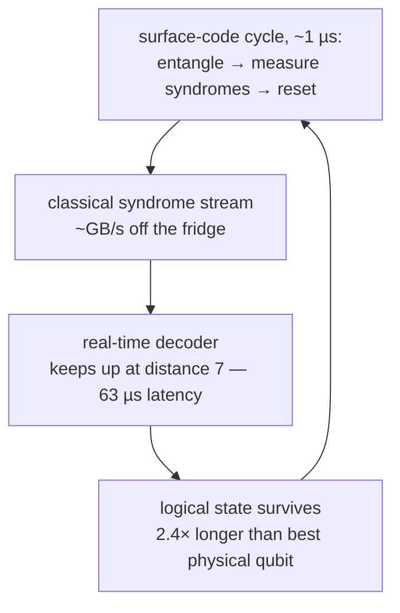

# Google — Sycamore to Willow

*Machine autopsy. Specs as of 2026-07, sourced in
[`data.yml`](https://github.com/mamuncseru/quantum-advantage-quest/blob/main/machines/data.yml).*

## 1 · Who & lineage

Google Quantum AI (Santa Barbara) is the lab that made "quantum supremacy" a
household phrase and "below threshold" the field's new finish line. Built by
hiring John Martinis' UCSB group wholesale in 2014; led on the research side
by Hartmut Neven since 2012.

| Chip | Year | Qubits | The lesson it taught |
|---|---|---:|---|
| Bristlecone | 2018 | 72 | count first didn't work here either |
| Sycamore | 2019 | 53 | RCS "supremacy" — and its slow classical death |
| Willow | 2024 | 105 | below-threshold error correction |

Unlike IBM, Google sells no cloud access to these chips. The machine *is*
the paper: every generation exists to hit one milestone on their public
ladder (M1 beyond-classical 2019 → M2 below-threshold logical qubit 2024 →
… → M6, a million physical qubits).

## 2 · The qubit

A **frequency-tunable transmon** — the same Josephson cosine well as IBM's
qubit ([level diagram on the IBM page](ibm.md#2--the-qubit)), but with the
single junction replaced by a **SQUID loop**: thread flux through the loop
and ω₀₁ moves. Every qubit gets a flux-bias line; every neighbor pair gets a
tunable coupler.

The trade against IBM's fixed-frequency choice is exact and instructive:

| | Google (tunable) | IBM (fixed) |
|---|---|---|
| Frequency collisions | tuned away in software | avoided by geometry (heavy-hex) |
| 2Q gate | fast flux-pulsed CZ | coupler-mediated CZ |
| Flux noise | first-order sensitive → T1 ≈ 100 µs | immune → T1 ≈ 250–350 µs |
| Lattice | square, degree 4 | heavy-hex, degree ≤ 3 (until Nighthawk) |

Willow's mean numbers: **CZ error 3.3×10⁻³**, 1Q error 3.5×10⁻⁴, T1
approaching 100 µs — a ~300-gate depth budget, deliberately spent on error
correction rather than on deep bare circuits.

## 3 · How gates happen

1Q gates are shaped microwave pulses (~25 ns). The native CZ is *flux
choreography*: pull the pair near the |11⟩↔|02⟩ avoided crossing with the
coupler on, let the interaction accumulate exactly π of conditional phase,
snap everything back. Fast (~tens of ns), but every flux pulse is an
opportunity for leakage into |2⟩ — one reason the surface-code papers spend
sections on leakage removal. Readout is dispersive, with dedicated reset.

## 4 · System architecture

A square grid of degree 4 ([lattice figure on the IBM page](ibm.md#4--system-architecture))
— which is not a routing convenience but a **surface-code floor plan**: data
and measure qubits interleave in exactly this pattern. The chip is the code.

The loop above is Willow's actual achievement: not the qubits themselves but
the fact that the **whole cycle closes in real time** — syndrome extraction,
decoding, and correction running continuously for a million cycles.

## 5 · The numbers

| Metric | Willow | Source quality |
|---|---|---|
| Physical qubits | 105 | published |
| 2Q (CZ) error, mean | 3.3×10⁻³ | Nature 2025 |
| 1Q error, mean | 3.5×10⁻⁴ | Nature 2025 |
| T1 | ≈100 µs | vendor |
| Surface-code cycle | ~1.1 µs | Nature 2025 |
| Λ (error suppression / distance step) | 2.14 | Nature 2025 |

## 6 · Error correction status

**The below-threshold result (Dec 2024) is the most important hardware
result of the decade.** Surface codes at distance 3 → 5 → 7 on the same
chip, each step *halving* the logical error rate (Λ = 2.14): the first
demonstration anywhere that making the code bigger makes things better.
One logical qubit, lifetime 2.4× the best physical qubit on the chip —
"break-even, then some," with real-time decoding. Since then: color-code
logical qubits and magic-state work on the same platform. The gap to
*useful* fault tolerance is still enormous (Λ^k must buy ~10⁻¹⁰ logical
error, thousands of physical qubits per logical), but the sign of the
derivative is finally right.

**Distance to theory:** at Willow's 3.3×10⁻³ mean CZ error, one
10⁻¹²-grade logical qubit costs distance-45 ≈ **4,050 physical qubits —
39× the whole chip**; the demonstrated d=7 logical qubit has an error rate
around 10⁻³ per cycle, nine orders from the algorithmic target. And the
below-threshold result is memory + Clifford only — the fault-tolerant
T gate does not exist here or anywhere.
[The gap, computed →](gap.md#2--the-gap-computed)

!!! danger "⚔ The skeptic's box"

    - **Sycamore 2019 is the field's great cautionary tale.** "10,000 years
      classically" lasted until IBM's 2.5-day rebuttal on paper, then
      tensor-network samplers (Pan et al. and successors) reproduced the
      task outright — by 2023 the original margin was effectively gone.
      This repository treats it as the type specimen of
      [claim-decay](metrics.md#7-advantage-claims--the-special-rules).
    - **Willow's RCS number ("10²⁵ years") is unverifiable by construction**
      — nobody can check the samples at that size; the estimate leans on
      extrapolated XEB fidelity. History says: wait.
    - **"Quantum Echoes" (Oct 2025)** — an OTOC measurement claimed at
      13,000× the best classical method, marketed as "first verifiable
      advantage." The verification is *self*-verification (time-reversal on
      the same device) plus cross-checks against NMR, not efficient
      classical verification. The classical attack cycle opened within
      weeks; treat the margin as provisional until it survives a year.
    - The below-threshold result, by contrast, has drawn **no serious
      technical challenge** — the criticism is only about how far it
      remains from useful scale. That silence is informative.

## 7 · Roadmap & sources

Watch for: Λ holding (or not) at distance ≥ 11 on the next chip, logical
*gates* between surface-code patches, and whether Quantum Echoes survives
its classical attackers better than RCS did.

- [Willow announcement (Dec 2024)](https://blog.google/technology/research/google-willow-quantum-chip/)
- [Below-threshold surface code memory (Nature 2025)](https://www.nature.com/articles/s41586-024-08449-y)
- [Quantum AI milestone ladder](https://quantumai.google/roadmap)
- Sycamore spoofing lineage: Pan & Zhang (PRL 2022), and successors
