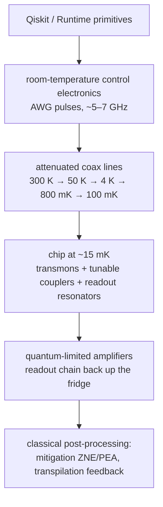

# IBM — Heron, Nighthawk, and the road to Starling

*Machine autopsy. Specs as of 2026-07, sourced in
[`data.yml`](https://github.com/mamuncseru/quantum-advantage-quest/blob/main/machines/data.yml).*

## 1 · Who & lineage

IBM Quantum (T.J. Watson Research Center, Yorktown Heights) is the oldest
continuous superconducting-qubit program in industry and the reason the field
has a cloud: the 5-qubit Quantum Experience went public in **2016**, and
Qiskit followed in 2017. Nobody else has a decade of fleet-scale calibration
data, and it shows in how they argue.

| Chip | Year | Qubits | The lesson it taught |
|---|---|---:|---|
| Falcon | 2020 | 27 | heavy-hex settled as the layout |
| Eagle | 2021 | 127 | first past 100; the "utility" experiment chip |
| Osprey | 2022 | 433 | scaling the package, not the physics |
| Condor | 2023 | 1,121 | **the deliberate dead end** — count without quality |
| Heron r2 | 2024 | 156 | tunable couplers; quality-first turn |
| Nighthawk | 2025 | 120 | square lattice; the declared advantage vehicle |
| Loon | 2025 | 112 | qLDPC plumbing test chip (long-range couplers) |

Condor is the most instructive row: IBM built the thousand-qubit chip, put it
in a press release, and **never deployed it**. Everything after it is smaller
and better — the clearest public admission that the depth budget, not the
qubit count, is the binding constraint (see
[the landscape](index.md#the-depth-budget)).

## 2 · The qubit

A **fixed-frequency transmon**: a single Josephson junction shunted by a
large capacitor, sitting at ω₀₁ ≈ 5 GHz with anharmonicity ≈ −300 MHz.

*Fixed*-frequency is IBM's signature choice. No SQUID loop, no flux line —
therefore no first-order sensitivity to flux noise, which buys the fleet's
long coherence (median T1 ≈ 250 µs on Heron r2, ≈ 350 µs on Nighthawk —
roughly 3× Google's tunable transmons). The price: you cannot move qubits in
frequency, so two qubits that happen to sit at colliding frequencies stay
collided forever. That price shaped the whole architecture — see §4.

## 3 · How gates happen

- **1Q:** shaped microwave pulses at ω₀₁ (`SX`, plus `RZ` done *virtually* —
  a bookkeeping rotation of the pulse frame, zero duration, zero error).
- **2Q, the old way (Eagle):** *cross-resonance* — drive qubit A at qubit
  B's frequency; all-microwave, no extra hardware, but slow (~450 ns) and
  leaky with spectators.
- **2Q, the current way (Heron/Nighthawk):** a **tunable coupler** between
  each pair — a flux-controlled circuit element whose only job is to switch
  the qubit–qubit interaction on and off. Native **CZ in ~68 ns** with the
  coupling truly *off* when idle, which killed the spectator-error problem
  that plagued Eagle-class chips.
- **Readout:** dispersive — each qubit shifts a readout resonator's
  frequency by its state; ~1% error class, the quiet tax on every shot
  (see [the primer](metrics.md#3-gate-fidelity--where-the-bodies-are-buried), question 4).

## 4 · System architecture

The heavy-hex lattice is the fixed-frequency price paid in geometry: at
degree ≤ 3, each qubit has few enough neighbors that frequency collisions
stay rare at fab time.

Nighthawk moves to the square lattice anyway — tunable couplers absorb the
collision problem, and degree 4 cuts the SWAP overhead that made heavy-hex
routing expensive (IBM quotes ~30% more usable circuit complexity; vendor
number, plausible mechanism).

One dilution refrigerator per system; the wiring harness — two-plus control
lines per qubit snaking through five temperature stages — is the real
scaling wall, and the reason IBM's fault-tolerance plan (§6) leans on
couplers and codes rather than raw count.

## 5 · The numbers

| Metric | Heron r2 | Nighthawk | Source quality |
|---|---|---|---|
| Physical qubits | 156 | 120 | published |
| 2Q (CZ) error, median | ~3×10⁻³ | not yet published | fleet calibration |
| CZ duration | ~68 ns | — | published |
| Median T1 | ~250 µs | ~350 µs | vendor |
| Circuit capacity claim | — | ~5,000 2Q gates | vendor |
| Depth budget (1/ε) | ~330 gates | — | derived |

IBM's honest-metrics contribution is **EPLG / layer fidelity** (error per
layered gate over a 100-qubit chain) and **CLOPS** (circuit layers per
second) — the fleet-scale and wall-clock numbers most vendors omit. Their
superconducting clock advantage is enormous: ~10⁵ circuit layers per second
against single-digit shots per second for QCCD ion machines.

## 6 · Error correction status

IBM is the only leader that **rejected the surface code**. Their bet is the
bivariate-bicycle "**gross code**" — a qLDPC code storing **12 logical
qubits in 144 physical** (plus 144 checks), ~10× better encoding rate than
surface codes at comparable distance. The catch: it needs degree-6
connectivity with *long-range* couplers that don't exist on any deployed
chip — that is exactly what the **Loon** test chip (2025) demonstrates
piece by piece. The declared ladder: Loon → Kookaburra (module, 2026) →
Cockatoo (linked modules, 2027) → **Starling: ~200 logical qubits, 100M
logical gates, 2029** in a purpose-built Poughkeepsie building. No logical
qubits demonstrated on deployed hardware yet — the bet is all forward.

!!! danger "⚔ The skeptic's box"

    - **The 2023 "utility" claim died in weeks.** The Eagle kicked-Ising
      experiment (Nature, June 2023) was matched by tensor networks and then
      by Pauli-propagation methods on a laptop. It remains this repository's
      canonical [cautionary tale](../ROADMAP.md#cautionary-tales-pinned).
    - **"Quantum advantage by end of 2026"** is a declared corporate target
      riding on Nighthawk. IBM now co-runs a public advantage tracker
      inviting classical rebuttals — good epistemics, but note the framing:
      the vendor also referees the benchmark suite.
    - **The gross code is brilliant on paper and undemonstrated in hardware.**
      Long-range couplers at scale, real-time qLDPC decoding, and logical
      gates on a high-rate code each carry independent technical risk; the
      2029 date prices in all three going right.

## 7 · Roadmap & sources

Watch for: Nighthawk fleet medians (the missing number above), first
gross-code logical memory on Loon-class hardware, and whether the 2026
advantage demonstrations survive their classical attackers.

- [IBM Nov 2025 announcement — Nighthawk, Loon](https://newsroom.ibm.com/2025-11-12-ibm-delivers-new-quantum-processors,-software,-and-algorithm-breakthroughs-on-path-to-advantage-and-fault-tolerance)
- [Nighthawk availability note (Jan 2026)](https://quantum.cloud.ibm.com/announcements/en/product-updates/2026-01-05-nighthawk)
- [Bravyi et al., high-threshold qLDPC memory (Nature 2024)](https://www.nature.com/articles/s41586-024-07107-7)
- [IBM Quantum roadmap](https://www.ibm.com/roadmaps/quantum/)
- Classical attacks on the utility experiment: Tindall et al. (PRX Quantum
  2024), Begušić & Chan (Sci. Adv. 2024)
