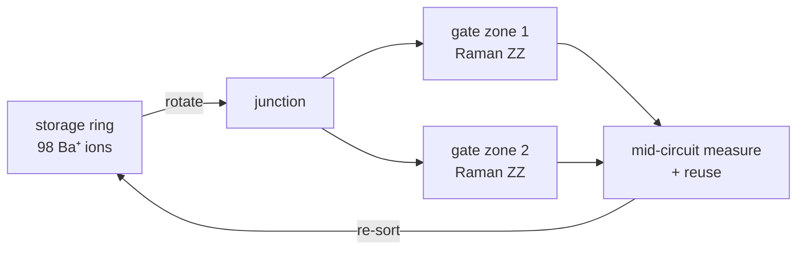

# Quantinuum — H2 and Helios

*Machine autopsy. Specs as of 2026-07, sourced in
[`data.yml`](https://github.com/mamuncseru/quantum-advantage-quest/blob/main/machines/data.yml).*

## 1 · Who & lineage

Quantinuum = Honeywell Quantum Solutions (the hardware, Broomfield CO) +
Cambridge Quantum (the software, UK), merged 2021; IPO filings landed in
2026. The trap lineage runs straight back to the 2002 NIST **QCCD**
proposal (Kielpinski–Monroe–Wineland) — this is the company that actually
built the architecture the ion-trap founders drew on a whiteboard.

| Machine | Year | Qubits | The lesson it taught |
|---|---|---:|---|
| H1 | 2020 | 20 | QCCD works; mid-circuit measurement arrives |
| H2 | 2023→24 | 32→56 | racetrack trap; quantum-volume record line |
| Helios | 2025 | 98 | sub-10⁻³ two-qubit error at ~100 qubits |

The house style is conspicuous: fidelity records first, qubit counts last,
and specs published in papers rather than press releases. In a field of
marketing, that earns real credibility — which is precisely why their
*vendor-benchmarked* claims deserve the same scrutiny as everyone else's.

## 2 · The qubit

Hyperfine "clock" states of a single trapped ion — **¹⁷¹Yb⁺** on the H
series, **¹³⁷Ba⁺** on Helios (barium's visible-wavelength transitions are
friendlier to photonics). Every qubit is the same atom, so there is no
fabrication spread: qubit #97 is *identical* to qubit #1, coherence is
effectively seconds-to-minutes, and the machine's error budget lives
entirely in the *control*, not the qubit.

## 3 · How gates happen

Laser-driven. 1Q gates are Raman transitions (two beams, detuned from the
P-manifold); the native 2Q gate is an arbitrary-angle **ZZ** interaction via
a Mølmer–Sørensen-type scheme — the ions' shared motional mode is the bus.
Gate times sit in the ~100 µs class, three orders of magnitude slower than a
transmon CZ. That is the modality's defining trade: near-perfect gates,
paid for in wall-clock time.

## 4 · System architecture

**QCCD — the ions physically move.** Electrode voltages shuttle, split, and
recombine ion crystals between storage and gate zones (see figure above).
Any ion can be transported next to any other: **all-to-all connectivity
with zero SWAP overhead**, plus native mid-circuit measurement and qubit
reuse. H2 arranges the rail as a racetrack; Helios upgrades it to a
**rotatable storage ring feeding two gate regions through a junction** —
ring rotation is cheaper than rail shuttling, which is how 98 qubits stayed
affordable.

The cost hides in the verbs: rotate, sort, cool, position — transport and
re-cooling dominate the cycle, so circuits execute at single-digit shots
per second against ~10⁵ layers/second for superconductors
([the CLOPS point](metrics.md#5-holistic-benchmarks--qv-clops-eplg-aq)).

## 5 · The numbers

| Metric | H2 | Helios | Source quality |
|---|---|---|---|
| Physical qubits | 56 | 98 | published |
| 2Q error (avg) | 1.3×10⁻³ | **7.9×10⁻⁴** | paper (arXiv:2511.05465) |
| 1Q error (avg) | 3×10⁻⁵ | 2.5×10⁻⁵ | paper |
| SPAM error | — | 4.8×10⁻⁴ | paper |
| Connectivity | all-to-all | all-to-all | architectural |
| Depth budget (1/ε) | ~770 | **~1,270** | derived |

Helios holds the highest published system-level 2Q fidelity of any
commercial machine — the first sub-10⁻³ error at ~100 qubits, which is why
it owns the bottom of [the landscape plot](index.md#the-landscape-in-one-picture).

## 6 · Error correction status

The most logical-qubit demonstrations of any platform except neutral atoms:
4 logical qubits with ~800× error suppression (with Microsoft, Apr 2024),
then 12 on H2 (Sep 2024), then a **48-logical-qubit launch demo on Helios**
(Nov 2025 — vendor claim, magnetism simulation). All-to-all connectivity
makes high-rate qLDPC codes natural here — the same code-rate argument as
[the neutral-atom story](metrics.md#6-logical-qubits--the-new-number-and-its-new-games),
with transport instead of tweezers. Declared ladder: Helios → Sol (2027) →
**Apollo (~2029, fully fault-tolerant)**.

**Distance to theory:** Helios's 7.9×10⁻⁴ is the field's best, and even
here one 10⁻¹²-grade logical qubit costs distance-19 ≈ **720 physical
qubits — 7× the machine**. The best quantum computer ever built holds zero
algorithm-grade logical qubits; it is simply the *closest* zero.
[The gap, computed →](gap.md#2--the-gap-computed)

!!! danger "⚔ The skeptic's box"

    - **The RCS claim (Jun 2024, with JPMorgan):** 56-qubit XEB estimated
      ~100× beyond classical. Same benchmark family as Sycamore/Zuchongzhi,
      same unverifiability at size, same historical decay pattern — being
      the most honest vendor does not exempt the benchmark.
    - **Wall-clock is the suppressed denominator.** At sub-10⁻³ error but
      single-shots-per-second, total useful work per day can still lose to
      a noisier, 10,000× faster superconducting fleet on mitigation-friendly
      workloads. Fidelity-only comparisons are half the ledger.
    - **Scaling QCCD past a few hundred ions** needs either monster traps
      or photonic interconnects between modules — the interconnect fidelity
      and rate numbers that would de-risk Sol/Apollo are not public.
    - **"48 logical qubits" at launch** is a vendor demo pending the paper:
      created/entangled/computed-with, which code, what post-selection —
      [the checklist questions](metrics.md#6-logical-qubits--the-new-number-and-its-new-games)
      are open until the write-up lands.

## 7 · Roadmap & sources

Watch for: the Helios logical-qubit paper, photonic module-interconnect
demos (the Sol gate), and whether anyone else reaches sub-10⁻³ at 100 qubits.

- [Helios paper (arXiv:2511.05465)](https://arxiv.org/abs/2511.05465)
- [Helios launch](https://www.quantinuum.com/press-releases/quantinuum-announces-commercial-launch-of-new-helios-quantum-computer-that-offers-unprecedented-accuracy-to-enable-generative-quantum-ai-genqai)
- [H2 RCS (arXiv:2406.02501)](https://arxiv.org/abs/2406.02501)
- [Sandia validation of Helios](https://quantumcomputingreport.com/sandia-national-laboratories-and-quantinuum-validate-98-qubit-helios-trapped-ion-framework/)
