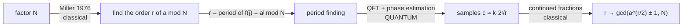

# Autopsy 04 — Shor (1994)

*The masterclass in problem-first thinking.*

!!! tip "How to read this page"

    This is the algorithm everyone has heard of, so it is written for
    someone who has heard the headline and nothing else. Sections 0–2
    contain **no quantum mechanics at all** — and that is the single most
    important fact about Shor's algorithm. Boxes marked **▸ deeper** hold
    the algebra; skip them freely on a first pass.

    The one thing to carry through the whole page:

    > **Shor is four ideas stacked, and only one of them is quantum — and
    > that one was already published, by Simon, months earlier.**

---

## 0. The clock that comes home

Pick a number, say **7**. Start at 1 and keep multiplying by 7, but every
time you pass 15, wrap around and keep only the remainder:

$$
1 \;\to\; 7 \;\to\; 4 \;\to\; 13 \;\to\; 1 \;\to\; 7 \;\to\; \cdots
$$

*(7 × 7 = 49, and 49 = 3×15 + 4, so we land on 4. Then 4 × 7 = 28 = 15 + 13,
so 13. Then 13 × 7 = 91 = 6×15 + 1, so 1 — home.)*

After **four** steps it comes home to 1. That number 4 has a name: the
**order** of 7 modulo 15.

Every starting number has such a homecoming time. And here is the claim this
entire page exists to explain:

!!! success "The whole algorithm in one sentence"

    **If you can find the order, you can factor the number.** And factoring
    large numbers is what RSA — the encryption behind essentially all
    secure communication — is betting you cannot do.

The astonishing part is that the *hard* part of that sentence is not the
quantum mechanics. It is noticing that the sentence is true at all.

---

## 1. The problem, and why the world cares

**Factor $N$.** Two thousand years old. RSA exists because, after centuries
of Fermat, Gauss, and finally the number field sieve, the best classical
algorithm known still takes superpolynomial time:

$$
\exp\!\Big(O\big((\log N)^{1/3} (\log\log N)^{2/3}\big)\Big)
$$

**This is the first problem in the curriculum that the world cared about
*before* quantum computing.** Deutsch–Jozsa, Bernstein–Vazirani and Simon
were all problems invented to showcase a mechanism. Factoring was not
invented by anybody — it was waiting.

That is not a coincidence. It is the whole story of this page, and the
reason this repository is organised around *finding problems* rather than
inventing circuits.

---

## 2. From factoring to order-finding — no quantum mechanics required

Here is the step that is genuinely Shor's, and it is pure number theory.

Play with it first. Pick $N$, pick a starting number $a$, watch the chain
come home, and watch the factors fall out:

<div class="qq-anim" data-anim="modorder"></div>

### Why it works

Suppose the order $r$ of $a$ is **even**. Then $a^r \equiv 1$, so writing
$x = a^{r/2}$:

$$
x^2 \equiv 1 \pmod N
\quad\Longrightarrow\quad
x^2 - 1 = (x-1)(x+1) \equiv 0 \pmod N
$$

So $N$ divides the product $(x-1)(x+1)$. Now — and this is the trick —
if $x \not\equiv \pm 1$, then $N$ divides **neither factor on its own**.
The only way a number can divide a product without dividing either piece is
for its prime factors to be *split between them*. So

$$
\gcd(x - 1,\, N) \quad\text{and}\quad \gcd(x + 1,\, N)
$$

are **non-trivial factors of $N$** — and gcd is Euclid's algorithm, which is
2,300 years old and instant.

!!! info "Where the luck comes in"

    Two things can go wrong: $r$ can be odd, or $x$ can come out equal to
    $N-1$ (which is $-1$ in disguise, the boring square root of 1). Either
    way you shrug and try another $a$. A random $a$ works with probability
    **at least 1/2**, so a handful of attempts suffices. Try it in the
    widget above — you will hit both failure modes quickly.

That reduction is due to **Miller, 1976** — eighteen years before Shor, and
entirely classical.



**Look at that diagram carefully.** Four boxes, and exactly one of them is
quantum. Everything else is classical mathematics that existed already.

So the classical wall is now precisely located: order finding **is** period
finding of the function $f(j) = a^j \bmod N$ — a function that is trivial to
compute and whose period is invisible to any known classical method short of
walking the whole chain, which is exponentially long.

---

## 3. Phase estimation — the one genuinely new machine

Now the quantum part. It rests on one idea the curriculum has not met yet,
so let us build it.

### The order is hiding in a spectrum

Consider the operation "multiply by $a$, mod $N$":

$$
U|x\rangle = |a x \bmod N\rangle
$$

This just walks you along the chain from §0. Apply it $r$ times and every
state returns to where it started, because $a^r \equiv 1$. So $U^r = I$.

Any operator with $U^r = I$ has eigenvalues that are **$r$-th roots of
unity**:

$$
e^{2\pi i k/r}, \qquad k = 0, 1, \dots, r-1
$$

**The order is the spectrum.** Finding $r$ has become: measure an eigenvalue
of $U$ precisely enough to read off its denominator.

??? note "▸ deeper — where the eigenvectors come from"

    The eigenvectors are the Fourier modes along the cycle:

    $$|u_k\rangle = \frac{1}{\sqrt r}\sum_{j=0}^{r-1}
      e^{-2\pi i kj/r}\,|a^j \bmod N\rangle$$

    Applying $U$ shifts the cycle by one step, which multiplies this
    superposition by $e^{2\pi i k/r}$ — so it is an eigenvector with that
    eigenvalue. Verify it on paper once; it is three lines.

### The trick that makes it practical

There is an obvious problem: to measure an eigenvalue you normally need the
**eigenvector**, and building $|u_k\rangle$ requires knowing $r$ — the thing
you are trying to find.

Shor's escape is one of the most elegant moves in the subject:

!!! success "Start in $|1\rangle$ and let the machine choose"

    The plain state $|1\rangle$ happens to be an **equal superposition of
    all $r$ eigenvectors**:

    $$|1\rangle = \frac{1}{\sqrt r}\sum_{k=0}^{r-1} |u_k\rangle$$

    So you feed in $|1\rangle$ — trivial to prepare — and the machine
    behaves as though you had picked one $k$ at random. You never learn
    which, and **you never need to**: every $k$ gives an eigenvalue whose
    denominator is $r$.

    You get a random one of the answers you wanted, which is exactly as
    good as choosing.

---

## 4. Simon's algorithm, one group over

Now the payoff for having done [autopsy 03](../03-simon/notes.md). The
circuit is Simon's, with $\mathbb{Z}_2^n$ swapped for $\mathbb{Z}_{2^t}$:

| | [Simon](../03-simon/notes.md) | **Shor** |
|---|---|---|
| the group | $\mathbb{Z}_2^n$ (XOR) | $\mathbb{Z}_{2^t}$ (addition) |
| hidden thing | a mask $s$ | a **period** $r$ |
| register 1 collapses to | a coset $\{x_0,\, x_0\oplus s\}$ | a **comb** $\{j_0,\, j_0+r,\, j_0+2r, \dots\}$ |
| the transform | $H^{\otimes n}$ | the QFT |
| what survives | $y$ with $y\cdot s = 0$ | $c \approx k\cdot 2^t/r$ |
| classical finish | Gaussian elimination | continued fractions |

Step through it — the interaction is deliberately the same as autopsy 03's,
because it is the same machine:

<div class="qq-anim" data-anim="shorcomb"></div>

The heart of it: **a comb of spacing $r$ transforms into a comb of spacing
$2^t/r$.** Squeeze the teeth together in one picture and they spread apart
in the other. That is all the Fourier transform is doing, and it is why
periods are what this machinery reads.

The random offset $j_0$ — which depends on the measurement outcome you
cannot control — shows up only as a phase, and phases do not affect
measurement probabilities. Exactly as in Simon, the thing you do not know
turns out not to matter.

---

## 5. Reading the answer

The machine hands you a number $c$ with $c/2^t \approx k/r$ for some random
$k$. Two questions remain: how much precision do you need, and how do you
get $r$ out?

### How many counting qubits?

The code uses $t = 2m+1$ where $m$ is the number of bits of $N$. Why not
fewer? Because $c/2^t$ must be close enough to $k/r$ that **no other
fraction with a small denominator is closer**. Watch the recovery
probability as you change $t$:

<div class="qq-anim" data-anim="precision"></div>

Note also what happens when $r$ does **not** divide $2^t$ — the peaks smear
out instead of being razor-sharp. They stay concentrated enough, which is
the content of the standard error analysis, but it is why you buy spare
precision rather than exactly enough.

### Continued fractions

Given $c/2^t$, find the fraction with the smallest denominator that is very
close to it. That is precisely what **continued fractions** do:

<div class="qq-anim" data-anim="contfrac"></div>

The convergents climb toward $c/2^t$, and the last one whose denominator is
still below $N$ is your candidate $r$. Then you *check* it — compute
$a^r \bmod N$ and see whether it is 1. Verification is free, which means a
wrong guess costs you nothing but another run.

??? note "▸ deeper — why $\gcd(k, r) > 1$ is not fatal"

    If the random $k$ shares a factor with $r$, the fraction $k/r$ arrives
    already reduced and continued fractions hand you a proper **divisor**
    of $r$ instead of $r$ itself. The fix is the `mult` loop in
    [`shor.py`](shor.py): try small multiples of the candidate until
    $a^{r} \equiv 1$. It is cheap, and a random $k$ is coprime to $r$ often
    enough that few repeats are needed. (This is the third exercise.)

<figure markdown="span">
  
  
  <figcaption>Our simulator, N = 15, a = 7, t = 9 counting qubits: the
  measured distribution is four razor peaks at c = k·512/4 — the order
  r = 4, written by interference. This figure is the moment number theory
  becomes a measurement.</figcaption>
</figure>

---

## 6. Where the cost actually is

Folklore puts the magic in the QFT. **The engineering is in the
arithmetic.**

Look at what the cascade demands: controlled-$U^{2^j}$ for every counting
qubit, where $U$ multiplies by $a$ modulo $N$. On real hardware that is
**reversible modular arithmetic** — adders, comparators, and the scratch
space they need — repeated thousands of times. The QFT, by comparison, is
$t(t-1)/2$ phase rotations and is essentially free.

!!! warning "Our own code cheats, and the cheat is instructive"

    [`shor.py`](shor.py)'s `mod_mult_unitary` builds a dense
    $2^m \times 2^m$ permutation matrix. That is exponential classical work
    — perfectly fine for *simulating* 13 qubits, and completely impossible
    as a circuit.

    This is the [query-model fine print](../01-deutsch-jozsa/notes.md#1-what-an-oracle-actually-is)
    wearing different clothes: it is easy to write down an oracle, and the
    entire engineering problem is building one. For Shor the oracle *is*
    buildable — that is his whole contribution — but "buildable" and
    "cheap" are very different words, as the next section shows.

---

## 7. Shor cannot factor 15 on any machine that exists

Let us stop hand-waving and price it, using this repo's
[machine catalog](../../machines/index.md) and
[feasibility calculator](../../machines/toolkit.md).

Take the schoolbook cost model — modular exponentiation as $2t$ modular
multiplications, each $n$ modular additions, each about $4n$ Toffoli gates,
one Toffoli ≈ 6 CNOTs (all stated in
[`shor_resources.py`](shor_resources.py) so you can argue with it). For
$N = 15$:

| | |
|---|---|
| qubits | **13** ($m=4$ work, $t=9$ counting) |
| controlled multiplications | 9 |
| two-qubit gates after decomposition | **≈ 6,900** |

Thirteen qubits. Every machine in the catalog has more than thirteen qubits.
And yet:

| machine | verdict | P(no error at all) |
|---|---|---:|
| Quantinuum Helios | **NO** | 4.2×10⁻³ |
| Quantinuum H2 | **NO** | 1.1×10⁻⁴ |
| IonQ Forte | **NO** | 8.2×10⁻¹³ |
| Google Willow | **NO** | 1.7×10⁻⁵² |
| IBM Heron r2 | **NO** | 2.7×10⁻⁸⁰ |

<figure markdown="span">
  
  
  <figcaption>Left: each machine's total error budget (gates before the
  first expected error) against the 6,900 gates Shor-15 needs — the red
  line is out of everyone's reach. Right: the requirement versus modulus
  size, with the best machine's budget as a dashed floor. Generated by
  <code>scripts/make_shor_figures.py</code> from
  <code>machines/data.yml</code>.</figcaption>
</figure>

!!! danger "The number that should reset your intuition"

    **The most famous algorithm in quantum computing cannot factor 15 on
    the best machine ever built** — not because 13 qubits is too many, but
    because ~6,900 two-qubit gates is far past every machine's entire
    error budget ([the depth budget](../../machines/metrics.md#4-the-depth-budget--1%CE%B5)).

    Scale to RSA-2048 and the schoolbook model needs ~10¹¹ Toffoli gates;
    the best known optimisation (Gidney–Ekerå 2019, windowed arithmetic)
    gets that to 2.7×10⁹ with ~20 million physical qubits. Either way the
    conclusion is the one the [gap page](../../machines/gap.md) reaches
    independently: **this needs fault tolerance, not better NISQ
    hardware.**

---

## 8. Every published factorization is compiled

So how do all those headlines exist? *"Scientists factor 15 with a quantum
computer."* *"Researchers factor 143."* *"Quantum computer factors 291311."*

Because those circuits were **built using the answer**.

The critique is not ours — it is Smolin, Smith and Vargo, *Oversimplifying
quantum factoring* (Nature 499, 163, 2013). But we can make it precise on
our own code, and the mechanism is beautifully simple.

The cascade applies controlled-$U^{2^j}$ for $j = 0, \dots, t-1$. That gate
is the **identity** exactly when $a^{2^j} \equiv 1 \pmod N$ — that is,
whenever the order $r$ divides $2^j$. So:

- $r$ a **power of two** → the cascade collapses to $\log_2 r$ real gates;
- $r$ with **any odd factor** → all $t$ gates are non-trivial.

A demonstration therefore wants an $a$ whose order is a small power of two.
With $r = 2$ the entire quantum cascade is **one controlled operation**.
Measured on our own implementation
([`shor_compiled_cheat.py`](shor_compiled_cheat.py)):

| N | honest gates | cheapest demo | how much of the circuit vanishes | fraction of bases that collapse |
|---|---:|---:|---:|---:|
| 15 | 9 | **1** | 89% | **7/7 — 100%** |
| 21 | 11 | 1 | 91% | 3/11 — 27% |
| 35 | 13 | 1 | 92% | 7/23 — 30% |

**And to pick such an $a$ you must know its order** — which is the problem
the algorithm is supposed to solve. Choosing the convenient base is using
the answer to compute the answer.

!!! info "Why it is always 15 — and the small theorem behind it"

    Look at the last column. For $N=15$ **every** base collapses, so the
    demonstration works no matter what you pick.

    Measuring more semiprimes turned up the exact criterion, which is
    prettier than expected: every base collapses precisely when
    $\lambda(N)$ is a power of two, and for odd squarefree $N$ that happens
    **exactly when $N$ is a product of distinct Fermat primes**
    (3, 5, 17, 257, 65537). So $15 = 3\times5$, $51 = 3\times17$,
    $85 = 5\times17$ and $255 = 3\times5\times17$ are all "free" — and
    **15 is simply the smallest.**

    That is why it is always 15. Not tradition — arithmetic.

<figure markdown="span">
  
  
  <figcaption>Left: non-trivial gates per base for N = 15, 21, 35 against
  the honest circuit size (dotted). Green bases collapse. Right: the
  fraction of collapsing bases across odd semiprimes — 100% exactly at the
  products of Fermat primes.</figcaption>
</figure>

!!! danger "How to read a factoring headline"

    A compiled demonstration shows that the hardware can execute a handful
    of gates. It shows **nothing whatsoever about factoring**, because the
    circuit was constructed from knowledge of the factorization.

    The honest question to ask of any such result is the one this
    repository asks of everything: *would the circuit have been different
    if the experimenters had not known the answer?* For every factoring
    demonstration to date, yes. Same reflex as the
    [claim ledger](../../machines/gap.md) — and the same reflex Simon's
    autopsy applied to [its own demo oracle](../03-simon/notes.md#6-the-attack-on-the-oracle-everyone-actually-builds).

---

## 9. The hardness evidence

**Tier 2 — exactly the currency this program aims for.** There is **no
proof** that factoring is classically hard. What exists is:

- fifty years of the best mathematicians alive failing to find a
  polynomial algorithm;
- a trillion-dollar cryptographic ecosystem betting on that failure;
- **no dequantization in thirty years** — unlike
  [HHL](../10-hhl-tang/notes.md), where Tang's classical algorithms
  arrived and collapsed the claim;
- post-quantum cryptography being standardised *because* nobody expects
  factoring to become classically easy.

That is the strongest hardness evidence in this curriculum, and it is still
not a theorem.

!!! question "Stop and think"

    Simon needed a promise ("$f$ is 2-to-1 with an XOR mask"). Where did
    Shor's promise go?

    ??? success "Answer"

        It became a **theorem**. $f(j) = a^j \bmod N$ is genuinely periodic
        — group theory *guarantees* the structure that Simon had to assume.
        Instantiating the oracle did not just make the problem real; it
        made the promise **free**.

        Compare [Simon §6](../03-simon/notes.md#6-the-attack-on-the-oracle-everyone-actually-builds),
        where building a runnable oracle *destroyed* the promise. Shor
        found the case where building it costs nothing. That difference is
        the entire distance between a toy and a revolution.

---

## 10. The lesson

Written out in full because it is the course's centerpiece — argue with it,
then rewrite it in your own words:

<div class="qq-lesson" markdown>

**The quantum content of Shor's algorithm existed before Shor** (Simon's
subroutine, generalized from $\mathbb{Z}_2^n$ to $\mathbb{Z}$). What Shor
added was the *problem*: the recognition that (i) factoring reduces to order
finding, (ii) order finding is period finding, (iii) period finding is
exactly what Fourier sampling does, and (iv) the oracle can be
**instantiated** — $a^x \bmod N$ is efficiently computable. Every step except
(iii) is classical mathematics. The named algorithm = old primitive + new
problem + an instantiable oracle. The problem-shape: **answer encoded as the
period/coset structure of an efficiently computable function over an abelian
group.**

</div>

---

## Exercises

!!! example "Run it"

    ```bash
    .venv/bin/python predecessors/04-shor/shor.py                  # factors 15, 21, 35
    .venv/bin/python predecessors/04-shor/shor_resources.py        # §7
    .venv/bin/python predecessors/04-shor/shor_compiled_cheat.py   # §8
    .venv/bin/pytest predecessors/04-shor -q
    ```

- [ ] **Proof draft #2:** the Miller reduction (§2), including the
      probability-$\ge 1/2$ counting argument. Draft first; check against
      `curriculum/solutions.md`.
- [ ] In `find_order`, print the raw measured $c$ values for $N=21$, $a=2$
      and verify by hand that continued fractions on $c/2^t$ recovers $r=6$.
      (The §5 widget does exactly this arithmetic — use it to check
      yourself, not to replace the work.)
- [ ] Why does the algorithm still work when $\gcd(k,r) > 1$ makes the
      continued-fraction denominator a proper divisor of $r$? (Justify the
      `mult` loop in `find_order`.)
- [ ] Where exactly did Simon's promise become a theorem about
      $\mathbb{Z}_N$? (One paragraph.)
- [ ] **New:** §8 shows the cascade collapses iff the order is a power of
      two. Prove the criterion in the info box — that *every* base
      collapses exactly when $N$ is a product of distinct Fermat primes.
      (Hint: every order divides $\lambda(N)$; when is $\lambda(N)$ a power
      of two?)
