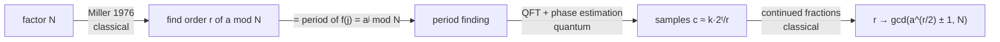

# Autopsy 04 — Shor (1994)

*The masterclass in problem-first thinking.*

## 1. The problem

**Factor $N$.** Two thousand years old. RSA exists because, after centuries of
Fermat, Gauss, and the number field sieve, the best classical algorithm is
still superpolynomial:

$$
\exp\!\Big(O\big((\log N)^{1/3} (\log\log N)^{2/3}\big)\Big).
$$

This is the first problem in our curriculum that the world cared about
*before* quantum computing. That is not a coincidence — it is the whole story.

## 2. The classical wall

The multiplicative group mod $N$ hides its order. Factoring reduces —
**classically**, Miller 1976 — to **order finding**: given $a$ coprime to
$N$, find the least $r$ with $a^r \equiv 1 \pmod N$.

The reduction (draft it yourself — exercise): if $r$ is even and
$x = a^{r/2} \not\equiv -1 \pmod N$, then $x^2 \equiv 1$ with $x \not\equiv
\pm 1$, so $N \mid (x-1)(x+1)$ while dividing neither factor —
$\gcd(x \pm 1, N)$ are nontrivial factors. A random $a$ works with
probability $\ge 1/2$.



So the wall is: order finding **is** period finding of an efficiently
computable function — whose period is invisible to any known classical
sampling of its values.

## 3. The primitive

Simon's algorithm with $\mathbb{Z}_2^n$ replaced by $\mathbb{Z}$: phase
estimation of the unitary $U\,|x\rangle = |ax \bmod N\rangle$. The eigenvalues
of $U$ are

$$
e^{2\pi i k/r}, \qquad k = 0,\dots,r-1
$$

— **the order lives in the spectrum**, and the QFT over $\mathbb{Z}_{2^t}$
reads it out: controlled powers $U^{2^j}$ entangle the counting register with
the eigenphases; the inverse QFT concentrates amplitude near
$c \approx k\,2^t/r$; continued fractions recover $r$ from $c/2^t$.

<figure markdown="span">
  
  
  <figcaption>Our simulator, N = 15, a = 7, t = 9 counting qubits: the
  measured distribution is four razor peaks at c = k·512/4 — the order r = 4,
  written by interference. This figure is the moment number theory becomes a
  measurement.</figcaption>
</figure>

Same architecture as Simon — quantum Fourier samples, then classical
post-processing (continued fractions instead of Gaussian elimination). Two
details that matter, both visible in [`shor.py`](shor.py):

- The work register starts at $|1\rangle$, which is a uniform mixture of the
  $r$ eigenstates with phases $k/r$ — **you never need to prepare an
  eigenstate.**
- The true cost center is **modular exponentiation** (the controlled-$U^{2^j}$
  cascade), not the QFT. Folklore puts the magic in the QFT; the engineering
  lives in reversible arithmetic.

```python
for j in range(t):
    power = pow(a, 2 ** (t - 1 - j), N)          # classical repeated squaring
    psi = apply(psi, controlled(mod_mult_unitary(power, N, m)), [j] + work)
psi = qft_dagger(psi, list(range(t)))
```

## 4. The hardness evidence

Tier 2 — exactly the currency our program aims for. There is **no proof** that
factoring is classically hard: only fifty years of the best mathematicians
failing, and a trillion-dollar cryptographic ecosystem betting on that
failure. No dequantization in thirty years; post-quantum cryptography exists
*because* nobody expects one.

!!! question "Stop and think"

    Simon needed a promise ("f is 2-to-1 with XOR mask"). Where did Shor's
    promise go?

    ??? success "Answer"

        It became a *theorem*. $f(j) = a^j \bmod N$ is genuinely periodic —
        group theory guarantees the coset structure that Simon had to assume.
        Instantiating the oracle didn't just make the problem real; it made
        the promise free.

## 5. The lesson

Written out in full because it is the course's centerpiece — argue with it,
then rewrite it in your own words:

<div class="qq-lesson" markdown>

**The quantum content of Shor's algorithm existed before Shor** (Simon's
subroutine, generalized from $\mathbb{Z}_2^n$ to $\mathbb{Z}$). What Shor
added was the *problem*: the recognition that (i) factoring reduces to order
finding, (ii) order finding is period finding, (iii) period finding is
exactly what Fourier sampling does, and (iv) the oracle can be
**instantiated** — $a^x \bmod N$ is efficiently computable. Every step except
(iii) is classical mathematics. The named algorithm = old primitive + new
problem + an instantiable oracle. The problem-shape: **answer encoded as the
period/coset structure of an efficiently computable function over an abelian
group.**

</div>

## Exercises

!!! example "Run it"

    ```bash
    .venv/bin/python predecessors/04-shor/shor.py     # factors 15, 21, 35
    .venv/bin/pytest predecessors/04-shor -q
    ```

- [ ] **Proof draft #2:** the Miller reduction (§2), including the
      probability-$\ge 1/2$ counting argument. Draft first; check against
      `curriculum/solutions.md`.
- [ ] In `find_order`, print the raw measured $c$ values for $N=21$, $a=2$
      and verify by hand that continued fractions on $c/2^t$ recovers $r=6$.
- [ ] Why does the algorithm still work when $\gcd(k,r) > 1$ makes the
      continued-fraction denominator a proper divisor of $r$? (Justify the
      `mult` loop in `find_order`.)
- [ ] Where exactly did Simon's promise become a theorem about
      $\mathbb{Z}_N$? (One paragraph.)
