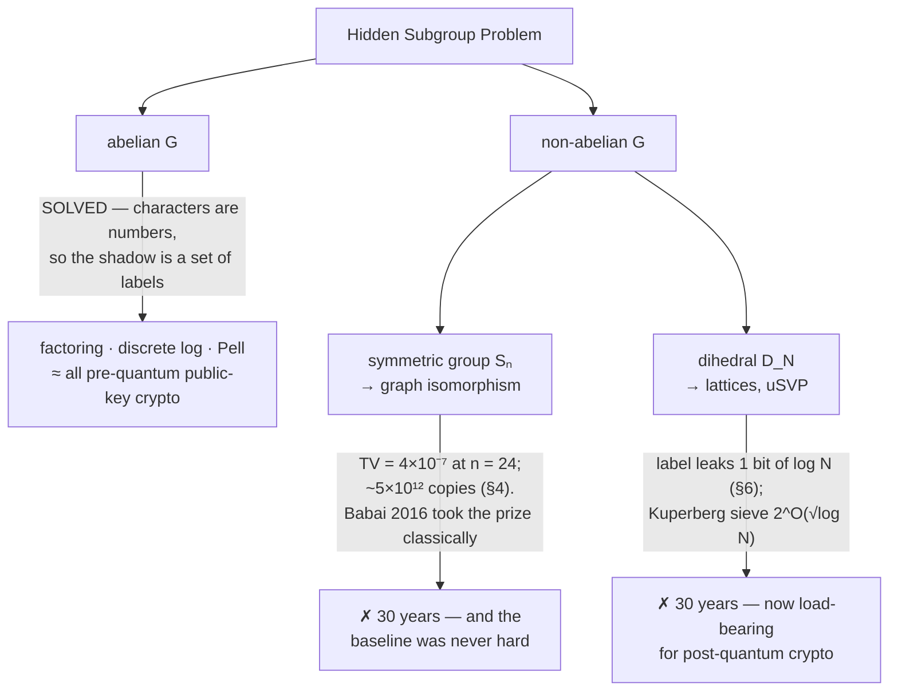

# Autopsy 05 — The Hidden Subgroup Problem, and where structure ends

*The framework that explained every win so far — and then predicted, precisely, where the wins would stop.*

!!! tip "How to read this page"

    The four autopsies before this one each took apart a single algorithm.
    This one takes apart the **pattern behind all of them**, and it is the
    hinge of the whole curriculum: everything before it is examples,
    everything after it is life beyond the examples.

    Sections 0–3 need no representation theory — a group, a subgroup, and
    the idea of "constant on cosets" is the whole vocabulary. Sections 4–6
    are the wall, and they are computed rather than cited: every number on
    this page comes out of
    [`abelian_hsp.py`](abelian_hsp.py),
    [`nonabelian_wall.py`](nonabelian_wall.py) and
    [`gi_baseline.py`](gi_baseline.py), pinned by 103 tests.

    The sentence to carry through:

    > **A framework that unifies your successes is worth something. A
    > framework that tells you exactly which failures were inevitable is
    > worth much more — and this one did both.**

---

## 0. Three wins that looked unrelated

By 1995 the field had three genuine results, and they looked like three
different tricks:

- **Bernstein–Vazirani** pulled an $n$-bit secret string out of one query.
- **Simon** found a hidden XOR period, with a provable exponential
  separation.
- **Shor** factored integers.

A secret string, a hidden period, and factoring. Nothing obviously in
common. Then someone noticed that all three are **the same program**, run on
three different groups, and that the only thing that changes between them is
the last line of *classical* arithmetic at the end.

That observation is the Hidden Subgroup Problem, and this page is what
happened next: an entire continent fell in about eighteen months, and then
everything stopped, for thirty years, along a line the framework itself
draws.

---

## 1. Cosets, in plain language

One piece of vocabulary, and then the whole framework fits in a sentence.

A **group** $G$ here is just a set of things you can add, where adding wraps
around: the integers mod 12 on a clock face, or $n$-bit strings under XOR. A
**subgroup** $H$ is a subset that is closed under the same operation — on
the clock, $\{0, 3, 6, 9\}$ is a subgroup.

A **coset** is a shifted copy of $H$. Shift $\{0,3,6,9\}$ by 1 and you get
$\{1,4,7,10\}$; by 2, $\{2,5,8,11\}$; by 3 you are back where you started.
The cosets tile the group exactly, with no overlaps and nothing left over —
four elements each, three of them, twelve in total.

!!! abstract "The Hidden Subgroup Problem"

    You are given a function $f$ on a group $G$ with one promise: **$f$ is
    constant on each coset of some subgroup $H$, and takes different values
    on different cosets.** $H$ is hidden; find it.

    In other words: $f$ is a machine that says "same coset" or "different
    coset", and nothing else. From that alone, reconstruct the subgroup.

Now the table that started it all:

| Algorithm | group $G$ | hidden subgroup $H$ | what $f$ is |
|---|---|---|---|
| [Bernstein–Vazirani](../02-bernstein-vazirani/notes.md) | $\mathbb{Z}_2^n$ | the hyperplane $\{x : s \cdot x = 0\}$ | $f(x) = s\cdot x$ |
| [Simon](../03-simon/notes.md) | $\mathbb{Z}_2^n$ | $\{0, s\}$ | any 2-to-1 $f$ with $f(x) = f(x \oplus s)$ |
| [Shor](../04-shor/notes.md), order-finding | $\mathbb{Z}_N$ | $r\mathbb{Z}$ | $f(x) = a^x \bmod M$ |
| Shor, discrete log | $\mathbb{Z}_r \times \mathbb{Z}_r$ | a line | $f(x,y) = g^x h^{-y}$ |
| Graph isomorphism | $S_n$ | the automorphism group | §5 |
| Lattices (uSVP) | dihedral $D_N$ | a reflection | §6 |

!!! warning "One member of the usual list does not belong"

    Deutsch–Jozsa is almost always printed in this table. It is not an HSP
    instance. A *constant* $f$ hides the whole group (the degenerate case),
    and a *linear* $f$ is just Bernstein–Vazirani — but a general balanced
    $f$ hides nothing at all: its fibers are not cosets of anything.

    Not an opinion: `test_deutsch_jozsa_is_not_an_hsp_instance` enumerates
    **all 16 subgroups** of $\mathbb{Z}_2^3$ and checks every one. Zero of
    them have the fibers of $x_0 \oplus (x_1 \wedge x_2)$ as their cosets.

    Small point, but it is the kind of thing that decides whether a
    framework is a real theorem or a filing cabinet.

---

## 2. One machine, three algorithms

Here is the entire procedure. It does not know which algorithm it is
running.

1. Build the uniform superposition over $G$ and call $f$ once.
2. **Measure the output register.** The input register collapses to a
   uniform superposition over one coset — a *coset state* — with an offset
   you neither know nor control.
3. Apply the Fourier transform **of the group $G$**.
4. Measure. You get a label.
5. Repeat until the labels determine $H$, then do classical algebra.

Steps 1–4 are identical in all three algorithms. Only step 5 differs:

<div class="qq-anim" data-anim="hspmachine"></div>

The blue bars are the labels that can possibly come out. They are never
arbitrary: the samples land **exactly** on the annihilator

$$
H^{\perp} \;=\; \{\, \text{characters } \chi \;:\; \chi(h) = 1 \ \text{for all } h \in H \,\},
$$

uniformly, and the unknown coset offset shows up only as a phase you cannot
see. That is the annihilator theorem, proved in
[deep dive 01 §7](../../study-deep-dive/01-fourier-thread/notes.md) and
verified here by running the simulator rather than quoting it
(`test_samples_always_land_in_the_annihilator`: 200 real samples, none
outside).

<figure markdown="span">
  
  
  <figcaption>Exact outcome distributions from
  <code>abelian_hsp.py</code> — the same <code>hsp_sample</code> function in
  all three panels. Blue is the annihilator; every other label has
  probability exactly zero.</figcaption>
</figure>

And the classical tails, in full:

| | what comes back | the last line |
|---|---|---|
| **Bernstein–Vazirani** | $H^{\perp} = \{0, s\}$, two labels | read the nonzero one — it *is* $s$ |
| **Simon** | $H^{\perp}$ = a hyperplane, $2^{n-1}$ labels | collect $n-1$ independent ones, solve over GF(2) |
| **Shor** | $H^{\perp}$ = multiples of $N/r$ | take the gcd |

Three famous algorithms, one machine, three different last lines. Feel how
little of the "quantum algorithm" is quantum: the device supplies uniform
random elements of a subgroup, and everything that looks like cleverness
happens in the classical column.

??? note "▸ deeper — why $n-1$ samples, and why the offset is unreachable"

    **Sizes.** $|H| \cdot |H^{\perp}| = |G|$ always
    (`test_annihilator_has_the_complementary_size`). Simon's $H = \{0,s\}$
    has size 2, so $H^{\perp}$ has size $2^{n-1}$ — a hyperplane, which
    needs $n-1$ independent vectors to pin down. Bernstein–Vazirani's $H$ is
    that same hyperplane, so its $H^{\perp}$ has size 2 and *one* sample
    finishes. **BV and Simon are the same problem with $H$ and $H^{\perp}$
    swapped**, which is the cleanest way to see why one is a one-shot
    algorithm and the other needs $n$ shots.

    **The offset.** Step 2 leaves you on a random coset $x_0 + H$, and $x_0$
    is uniformly random. After the transform it appears only in the phase of
    each amplitude, and no measurement sees a phase, so every probability is
    independent of it (`test_coset_offset_only_moves_phases`). You cannot
    learn the offset; you can only ever learn the subgroup. That is not a
    weakness of the algorithm — it is what makes the *same* algorithm work
    for every $f$ satisfying the promise.

---

## 3. The continent that fell

The abelian theorem — Fourier sampling solves HSP over any finite abelian
group with polynomially many queries — landed in the mid-1990s and took
with it:

- **factoring** (order-finding over $\mathbb{Z}_N$);
- **discrete logarithm**, in *every* group classical cryptography was using;
- **Pell's equation** and unit groups of number fields (Hallgren);
- and with them, essentially all of pre-quantum public-key cryptography.

That last item deserves a pause, because it is the transferable lesson of
this entire page:

!!! danger "Why all of classical public-key crypto fell at once"

    It was not luck, and it was not that cryptographers chose badly. A
    public-key cryptosystem needs a group operation you can compute
    *efficiently* on huge instances — and "efficiently computable group
    structure" in practice means **abelian**: modular multiplication,
    elliptic curve addition. The commutativity that makes those systems fast
    enough to deploy is the same commutativity that makes the characters
    one-dimensional and the Fourier sampling work.

    **The structure that made the problem usable is the structure that made
    it breakable.** When you go hunting for advantage, that trade is the
    first thing to look for — and §6 is what the world had to retreat to
    once it bit.

---

## 4. The wall

Everything above needed one property: on an abelian group, a character
sends each element to a single *number*, so the Fourier transform of a coset
state is a set of *labels*, and a label is something a measurement can
return.

On a non-abelian group that breaks. The irreducible representations are
matrices, of dimension $d_\lambda > 1$. The transform of a function lands in
blocks, and a measurement returns a triple (which block $\lambda$, which
row, which column) — where the row and column depend on a basis you had to
choose arbitrarily inside the block.

The weakest and most natural thing to do is to ignore the row and column and
keep only the block label. That is **weak Fourier sampling**, and its
outcome distribution has a clean closed form:

$$
P_H(\lambda) \;=\; \frac{d_\lambda}{|G|}\sum_{h \in H} \chi_\lambda(h) .
$$

With no hidden subgroup at all ($H = \{e\}$) this is $d_\lambda^2/|G|$. So
the question "can weak sampling see the hidden subgroup?" becomes: **how far
apart are those two distributions?** Which is a number, and numbers can be
computed.

So we computed it. `nonabelian_wall.py` builds the character table of $S_n$
from the Murnaghan–Nakayama rule (cross-checked against the hook length
formula and against the orthogonality relations), and measures the total
variation distance for a hidden involution:

<figure markdown="span">
  
  
  <figcaption>Exact values, not sampled. A transposition stays visible; a
  fixed-point-free involution vanishes. Right: copies needed, ≈ 1/TV².</figcaption>
</figure>

!!! success "The result, and it is sharper than the slogan"

    "Non-abelian groups are hard for quantum computers" is wrong, and the
    computation says so. Inside the *same* group, with the *same*
    measurement:

    - a hidden **transposition** (one swap) is easy to see. Its TV falls
      only like $2/n$ — $0.024$ at $n = 24$ — so a few thousand copies find
      it.
    - a hidden **fixed-point-free involution** (a perfect matching) is
      invisible. TV $= 4.3 \times 10^{-7}$ at $n = 24$, needing
      $\approx 5 \times 10^{12}$ copies, and falling by more than a factor
      of 3 for every 2 you add to $n$.

    At $n = 24$ the easy case is **ten thousand times** more visible than
    the hard one. The wall is not the group. It is *which subgroup you are
    hiding* — and graph isomorphism hands you the invisible one.

??? note "▸ deeper — why the perfect matching is exactly the GI case"

    Reduce graph isomorphism to HSP the standard way: given graphs $G_1,
    G_2$, form their disjoint union and ask for the automorphism group of
    the whole thing inside $S_{2m}$. If the two graphs are isomorphic, that
    automorphism group contains an element that swaps the two copies —
    which, having no fixed points, is a **perfect matching**. If they are
    not isomorphic, it does not.

    So "are these graphs isomorphic?" is exactly "is the hidden subgroup
    trivial, or does it contain a fixed-point-free involution?" — and the
    figure above says a single-register measurement cannot tell those two
    cases apart.

    This is the content of **Moore–Russell–Schulman (2005)**, *The symmetric
    group defies strong Fourier sampling*, and of
    **Hallgren–Moore–Rötteler–Russell–Sen**, which shows that even
    *entangled* measurements need $\Omega(n \log n)$ coset states at once —
    and no efficient circuit for such a measurement is known.

    The tests pin the numbers the figure draws
    (`test_fixed_point_free_involution_numbers_quoted_in_the_notes`,
    `test_the_gi_relevant_involution_falls_off_a_cliff`).

---

## 5. Graph isomorphism: a prize that evaporated twice

The reduction in that box is correct, and a quantum algorithm for
non-abelian HSP really would have solved graph isomorphism. So the
programme was rational. But this repository asks one question before any
other — *what was the classical baseline actually doing?* — and here the
answer is uncomfortable.

**Colour refinement** (1-dimensional Weisfeiler–Leman, 1968): colour every
vertex by its degree, then repeatedly recolour by the multiset of
neighbouring colours until nothing changes. Ten lines of code.

<div class="qq-anim" data-anim="colourwl"></div>

<figure markdown="span">
  
  
  <figcaption>Measured by <code>gi_baseline.py</code>. Left: every random
  non-isomorphic pair separated, at every size tested; by n = 20 every graph
  is canonically labelled outright. Right: the standard hard pair, and the
  invariant that walks past it.</figcaption>
</figure>

Three measured facts:

1. **Random instances are not hard.** 1-WL separated 100% of random
   non-isomorphic pairs at every size tested, and by $n = 20$ it refines a
   random graph until every vertex has its own colour — which is a canonical
   labelling, i.e. the isomorphism problem for that graph is simply over
   (`test_random_graph_pairs_are_settled_instantly`).
2. **The hard family is thin.** Refinement fails on strongly regular graphs,
   where every vertex looks identical forever. The standard smallest example
   is the $4\times4$ rook's graph versus the Shrikhande graph, both
   $(16,6,2,2)$.
3. **And even that falls to one more idea.** Look at the graph induced on a
   vertex's neighbours: in the rook's graph it is two disjoint triangles, in
   the Shrikhande graph it is a single 6-cycle. Same six vertices, same six
   edges — no counting argument sees it, but connectivity does. Since this
   is an isomorphism invariant, its disagreement is a *proof* that the two
   graphs differ (`test_one_more_cheap_invariant_walks_past_the_hard_pair`).

Then, in 2016, **Babai** proved graph isomorphism is solvable in
quasipolynomial time classically — taking the theoretical prize as well.

!!! danger "The pattern from autopsy 01, at the scale of a research programme"

    Deutsch–Jozsa's exponential separation was real against a *deterministic*
    classical machine and evaporated against a randomised one that nobody
    had bothered to write down. The graph isomorphism programme is the same
    failure mode, thirty years and hundreds of papers wide: an enormous
    quantum effort aimed at a problem that was
    **easy in practice the whole time**, and whose theoretical hardness then
    also dissolved — classically.

    The lesson is not "don't work on hard problems". It is: **price the
    classical baseline before you start, not after you fail.** A programme
    that had measured 1-WL on random graphs in 1995 would have known that
    the practical prize was already gone, and that only the adversarial
    tail was in play.

---

## 6. The dihedral group: where the money actually is

$D_N$ is the symmetry group of a regular $N$-gon: $N$ rotations, plus a
flip. It is as close to abelian as a non-abelian group gets — and it is
where the stakes are highest, because of a theorem of **Regev**: an
efficient algorithm for dihedral HSP with coset sampling would break
**unique shortest vector**, and with it the lattice problems that all
post-quantum cryptography now rests on.

So: how badly does the machine fail here? Precisely enough to measure.

<div class="qq-anim" data-anim="dihedral"></div>

<figure markdown="span">
  
  
  <figcaption>Computed from the D_N Fourier transform built out of its
  irreducible representations. Left: the label. Middle: the phase, which is
  exactly 2πkd/N. Right: the sieve's cost trade.</figcaption>
</figure>

!!! success "Measured, and it corrects the usual telling"

    The slogan is that the label tells you nothing. Not quite:

    - the **two-dimensional** labels are *exactly* independent of the hidden
      reflection — drift below $10^{-12}$ for every $N$ tested
      (`test_two_dimensional_labels_carry_nothing`);
    - the **one-dimensional** labels do move, and they reveal exactly one
      bit: whether the hidden offset $d$ is even or odd — and only when $N$
      is even. For odd $N$ nothing leaks at all
      (`test_even_N_leaks_exactly_the_parity_bit`, `test_odd_N_leaks_nothing_at_all`).

    One bit out of $\log_2 N$. Everything else survives as the relative
    phase $e^{2\pi i k d/N}$ inside a two-dimensional block
    (`test_the_secret_survives_only_as_a_phase`) — information that is
    genuinely present and that a single copy cannot extract.

That "present but unreadable" state is why the dihedral case is neither
solved nor hopeless, and it is exactly what **Kuperberg's sieve** attacks.
The move: two copies with labels $k_1, k_2$ can be combined into one copy
labelled $k_1 \pm k_2$. Match copies whose labels agree on their low bits,
subtract to clear those bits, repeat until a label reaches $N/2$ — which
reveals a bit of $d$ outright.

??? note "▸ deeper — where the square root comes from, derived rather than quoted"

    Each round clears a block of $t$ bits, and costs: you need $2^t$ copies
    just to fill the buckets, and half of every pairing is thrown away, so
    the population falls by a constant factor. Our simulation measures that
    factor at **4.1–4.2** (`sieve_decay_factor`), which calibrates the model

    $$
    \text{need}(0) = 1, \qquad
    \text{need}(r) = 4\,\text{need}(r-1) + 2^{t},
    \qquad r = \lceil n/t \rceil .
    $$

    A large block finishes in few rounds but pays $2^t$ each time; a small
    block is cheap per round but needs many. Minimising over $t$ puts the
    optimum at $t \approx \sqrt{n}$ — the right-hand panel of the figure —
    and the cost there is $2^{\Theta(\sqrt n)}$. Measured on the model:
    $\log_2(\text{cost})/\sqrt{n}$ comes out at 2.6, 2.5, 2.7, 2.7, 2.8 for
    $n = 16, 32, 64, 128, 256$ — flat, which is the claim.

    With $n = \log_2 N$ that is Kuperberg's $2^{O(\sqrt{\log N})}$. **The
    exponent is not a quotation on this page; it is the shape of that
    curve.**

Put a cryptographic size on it. At $N = 2^{256}$ the model wants about
$2^{44}$ coset states — versus $2^{256}$ for brute force, and versus roughly
$2^8$ if the problem were polynomial. Genuinely subexponential, and
genuinely nowhere near breaking anything. **Twenty years of work on this has
moved constants.**

!!! question "Stop and think"

    Thirty years of failure at dihedral HSP is usually written up as a
    disappointment. Whose asset is it?

    ??? success "One answer"

        The entire post-quantum cryptography ecosystem's. Lattice-based
        schemes are standardised and deploying now, and their security rests
        on exactly this failure — the way RSA's rested on nobody factoring.
        **A graveyard is a hardness assumption seen from the other side.**

        That reframing is worth carrying into the hunt. Every well-attacked
        negative result is simultaneously a candidate primitive, and the
        list of things quantum computers have *failed* to do for thirty
        years is a more reliable guide to hardness than any single proof.

---

## 7. The cautionary tale, pinned to the wall

April 2024: a well-known researcher posted a claimed quantum
polynomial-time algorithm for LWE — that is, for the lattice problems §6 is
about. It survived **ten days** before a subtle bug in one step (a modular
domain-extension of a Gaussian-windowed QFT) was found, by the author
together with the community, and withdrawn.

Two things worth keeping. First: the field ran the self-attack protocol and
it worked — publicly, quickly, without rancour. Second: **the error was in
exactly the place this page says the difficulty lives**, in the fine detail
of getting phase information out of a nearly-abelian structure. Even at
proof level, self-attack before belief.

---

## 8. Why the wall is where it is

Collecting the whole page into one paragraph:

The abelian machine works because a character is a *number*, so the hidden
subgroup casts a shadow that is a **set of labels** — and a measurement
returns labels. Non-abelian representations are *matrices*, so the shadow is
a set of matrix blocks: the label alone is nearly independent of the secret
(§4, §6), and the part that does depend on it lives in phases and basis
choices that a single copy cannot reach. The primitive did not get weaker.
**The problem's structure stopped matching it.**

And the price of "slightly non-abelian" is not qualitative but exactly
measurable: it is $2^{O(\sqrt{\log N})}$, the curve in §6.



---

## 9. The lesson — YOUR TURN

!!! abstract "Write this section yourself"

    Argue with the draft below, then replace it with your own.

    <div class="qq-lesson" markdown>

    **"Generalise the primitive" is a research programme with a thirty-year
    record of zero.** The abelian HSP was solved almost immediately; every
    attempt to push the same machine onto $S_n$ or $D_N$ has moved
    constants, not exponents, and the framework itself explains why —
    the mechanism needs the hidden object's shadow to be a set of *labels*,
    and non-abelian duality does not provide one.

    What *has* moved is the other end of the pipeline. Deep dive 01 §6 lays
    out the readable spectral shapes; the productive direction of the last
    decade has been to widen what the **readout** can do — DQI replaces
    "read the surviving frequency" with "decode it" — rather than to widen
    the group. If you are choosing where to push, the historical record says
    push there.

    And keep the inversion from §6: a graveyard is a hardness assumption
    seen from the other side. Our own hunt should be reading this
    curriculum's failures as a catalogue of *candidate hardness*, not only
    as a list of dead ends.

    </div>

Questions worth answering in your own words:

- What does the §5 story predict about any future quantum programme aimed at
  a problem whose practical instances nobody has measured?
- Could our hunt use a graveyard as a *primitive*? Which one, and what would
  the reduction look like?
- §4 shows the wall is subgroup-specific, not group-specific. Is there a
  non-abelian HSP instance whose hidden subgroup is the *visible* kind — and
  would anyone care about it?

---

## Exercises

!!! example "Run it"

    ```bash
    .venv/bin/python predecessors/05-hsp-graveyard/abelian_hsp.py      # §2
    .venv/bin/python predecessors/05-hsp-graveyard/nonabelian_wall.py  # §4, §6
    .venv/bin/python predecessors/05-hsp-graveyard/gi_baseline.py      # §5
    .venv/bin/pytest predecessors/05-hsp-graveyard -q                  # 103 tests
    ```

- [ ] State precisely why Simon's post-processing (linear algebra over
      $\mathbb{F}_2$) is the abelian-character statement in disguise. Then
      check yourself against the ▸ deeper box in §2 — in particular, why BV
      needs one sample and Simon needs $n-1$, when they hide *the same two
      subgroups* with the roles swapped.
- [ ] Add a group to `abelian_hsp.py` that is not a power of 2 or a single
      cycle — say $\mathbb{Z}_2 \times \mathbb{Z}_6$ — build an HSP instance
      on it, and write the classical tail. How much of the existing code did
      you have to change? (That number is the point of §2.)
- [ ] In `nonabelian_wall.py`, compute the TV distance for a hidden
      involution with exactly **two** fixed points, and for one with four.
      Where between "transposition" and "perfect matching" does visibility
      actually die? Plot it.
- [ ] 30 minutes with Kuperberg's sieve (arXiv quant-ph/0302112, §2–3).
      Understand the *shape*: combine coset states pairwise to cancel phase
      bits, trading quantity for progress. Then compare his parameters
      against the toy model in §6's deeper box — where does our decay factor
      of 4 come from in his analysis, and what does he do that we do not?
- [ ] **The uncomfortable one.** §5 says the classical baseline was never
      measured at the start of the programme. Pick any *current* quantum
      advantage claim you find persuasive and spend an hour measuring its
      classical baseline yourself. Write down what you found before reading
      anyone else's opinion.
