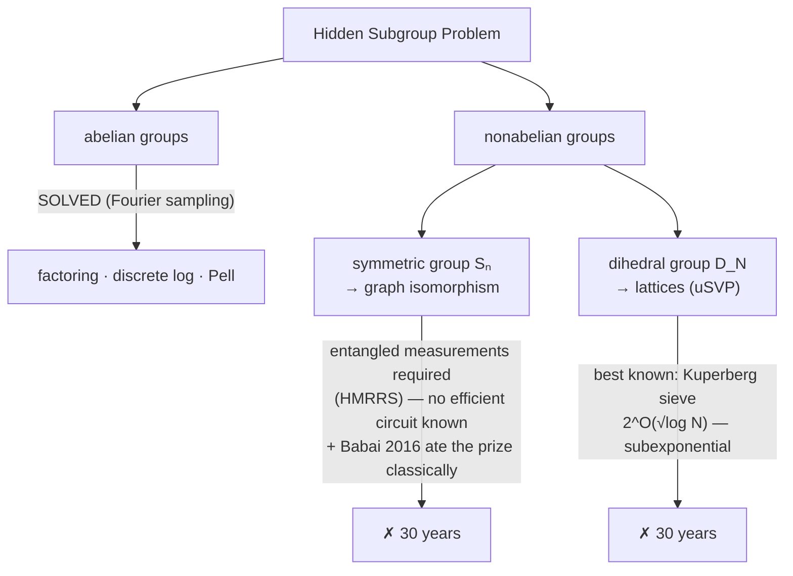

# Autopsy 05 — The Hidden Subgroup Problem, and where structure ends

*One framework unifies everything so far — and one graveyard bounds it.*

## 1. The problem

Unify DJ, BV, Simon, Shor: given a group $G$ and $f: G \to S$ constant
exactly on cosets of a hidden subgroup $H \le G$, **find $H$**. This is the
Hidden Subgroup Problem (HSP):

| Algorithm | Group $G$ | Hidden subgroup |
|---|---|---|
| Simon | $\mathbb{Z}_2^n$ | $\{0, s\}$ |
| Shor (order finding) | $\mathbb{Z}$ | $r\mathbb{Z}$ |
| Shor (discrete log) | $\mathbb{Z}_r \times \mathbb{Z}_r$ | a line |
| Graph isomorphism (open) | $S_n$ | — |
| Lattices / uSVP (open) | dihedral $D_N$ | a reflection |

## 2. What's solved

**Every finitely generated abelian $G$**: Fourier sampling over $G$ solves
HSP with polynomially many queries and efficient post-processing. Characters
are one-dimensional, the abelian QFT has efficient circuits, and measurement
statistics identify $H$ exactly as in Simon. This closed an entire continent
in the mid-1990s: factoring, discrete log in *all* groups classical crypto
used, Pell's equation, unit groups of number fields.

## 3. The graveyard

Two nonabelian targets carried enormous prizes, and neither fell:

- **Symmetric group $S_n$** → graph isomorphism. The coset-state approach
  provably requires entangled measurements across $\Omega(n \log n)$ states
  (Hallgren–Moore–Rötteler–Russell–Sen); no efficient such measurement is
  known. Meanwhile Babai's classical quasipolynomial algorithm (2016) ate
  most of the prize.
- **Dihedral $D_N$** → Regev: dihedral HSP with efficient coset sampling
  would break unique-SVP, i.e. post-quantum lattice crypto. Best known:
  **Kuperberg's sieve**, $2^{O(\sqrt{\log N})}$ — neither polynomial (which
  would be a revolution) nor stuck at exponential. Twenty years of effort has
  moved constants.

!!! danger "Cautionary tale — pinned to the wall"

    April 2024: a well-known researcher posted a claimed quantum
    polynomial-time algorithm for LWE (lattice crypto). It survived **ten
    days** before a subtle bug in one step — a modular domain-extension of a
    Gaussian-windowed QFT — was found. Even at proof level, self-attack
    before belief. The field ran that protocol, and it worked as intended.

## 4. Why the wall is where it is

The abelian magic: characters are one-dimensional, so Fourier sampling turns
coset structure into *phases*, and phases into measurable deltas. Nonabelian
representations are **matrices**: the frequency information smears across
representation spaces, single-copy measurements provably lose it, and the
required entangled measurements have no known efficient circuits. The
primitive didn't weaken — the problem's structure stopped matching it.

**Speedup ends where the group stops being abelian enough.** Kuperberg's
subexponential sieve is exactly the price of "slightly nonabelian."

## 5. The lesson — YOUR TURN

!!! abstract "Write this section yourself"

    What does this graveyard predict about "generalize the primitive" research
    programs? Note that thirty years of dihedral-HSP failure is also
    load-bearing *evidence* — the post-quantum lattice ecosystem rests on it
    the way RSA rests on factoring. **A graveyard is a hardness assumption
    seen from the other side.** Could our hunt use one that way?

## Exercises

- [ ] State precisely why Simon's post-processing (linear algebra over
      $\mathbb{F}_2$) is the abelian-character statement in disguise.
- [ ] No code for this autopsy. Instead: 30 minutes with Kuperberg's sieve
      (arXiv quant-ph/0302112, §2–3) — understand only the *shape*: combine
      coset states pairwise to cancel phase bits, trading quantity for
      progress. Where does $2^{O(\sqrt{\log N})}$ come from? One sentence.
