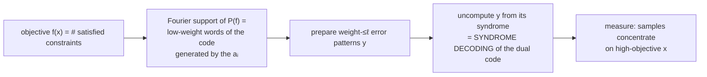

# Autopsy 12 — Decoded Quantum Interferometry (Jordan–Shutty et al. 2024)

*Hunting ground A. The newest genuine algorithmic idea in a decade.*

!!! info "Read with the frontier file open"

    The 2026 state of this ground — what got killed, what stands — lives in
    [the literature sweep](../../frontier/lit-sweep-2026H1.md). Primary
    source: arXiv 2408.08292. Verify every claim below at proof level; per
    our rules, nothing enters the hunt unverified.

## 1. The problem

**max-LinSAT**: satisfy as many linear constraints over a finite field as
possible. Two key cases:

- **max-XORSAT**: equations $a_i \cdot x = b_i$ over $\mathbb{F}_2$;
- **OPI (Optimal Polynomial Intersection)**: find a degree $< k$ polynomial
  $Q$ over $\mathbb{F}_p$ maximizing the number of points $i$ where
  $Q(y_i)$ lands in a prescribed set $F_i$. Equivalently: *noisy polynomial
  reconstruction* — a problem with a real cryptographic pedigree
  (Reed–Solomon list decoding, Naor–Pinkas oblivious polynomial evaluation).

## 2. The classical wall

For OPI the natural attacks are algebraic (lattice / Coppersmith-style noisy
interpolation — known variants don't reach it, per the sweep) and
information-set decoding (**Prange**), which achieves satisfied fraction
$\approx \tfrac12 + o(1)$ in the relevant regime. For *random sparse*
instances the wall turned out to be on the QUANTUM side — see §4.

## 3. The primitive

Problem-first to the bone:

1. The objective's Fourier spectrum lives on **low-weight combinations of the
   constraint vectors** — words of a code.
2. DQI prepares $\sum_x P(f(x))\,|x\rangle$ — amplitudes a degree-$\ell$
   *polynomial of the objective* — by building the state on the Fourier side
   and uncomputing with a **decoder**: decoding radius $\ell$ buys polynomial
   degree $\ell$.
3. The satisfied fraction follows the paper's **semicircle law** — a better
   decoder is a better optimizer.

The architecture, named for our catalog: **optimization → coding theory →
borrow the decoder.** Where Shor turned factoring into Fourier sampling, DQI
turns optimization into decoding — a sixty-year-old classical toolbox
becomes a quantum resource.

## 4. The hardness evidence — the 2026 ledger

From the sweep (verify before building on any of it):

| Regime | Status (July 2026) |
|---|---|
| random / sparse max-k-XORSAT | :material-close: **killed** — OGP/AMP obstructions; tight inapproximability; enhanced Prange matched even genuinely quantum LDPC decoders (the DQI team's own negative result, Apr 2026) |
| **OPI over $\mathbb{F}_p$ (Reed–Solomon)** | :material-check: **standing** — explicit searches found no classical attack; best classical remains Prange-type |
| Hermitian / AG-code OPI | :material-check: standing, younger, less attacked |
| rank-metric (Gabidulin) variants | :material-check: standing — classical side un-stress-tested (June 2026) |
| HDQI: Gibbs sampling via decoding | :material-help: open — the bridge to ground C |

Plus Sun–Wootters: DQI's semicircle law is *not optimal* on worst-case OPI —
headroom exists, for either side.

!!! tip "The 2026 lesson, compressed"

    **No DQI advantage without algebraic structure.** Randomness (sparse
    LDPC) fell to classical algorithms; structure (Reed–Solomon) has
    survived every attack so far. Connect this to the abelian-HSP lesson —
    it is the same shape.

## 5. The lesson — YOUR TURN

!!! abstract "Write this section yourself — this is the ground you'll hunt on"

    Where exactly does the quantum–classical asymmetry enter? (The quantum
    side needs the decoder to run *coherently on a superposition of
    syndromes* — when is that cheap?) Why did structure survive while
    randomness fell? And where would a new problem family plug in: new code,
    new metric, new decoder, or new objective-to-code reduction?

## Exercises

- [ ] Read 2408.08292 §1–3 at proof level; re-derive the Fourier-support
      claim for max-XORSAT yourself — it is Parseval plus the binomial
      expansion of $P(f)$.
- [ ] From the sweep: list the three 2026 negative results for sparse
      instances with a one-sentence mechanism each.
- [ ] **The hunt-phase question** (one page): what does a problem need to be
      "OPI-like enough" to inherit the advantage, yet different enough to be
      a new result? Candidate axes: field, metric, code family, promise.
