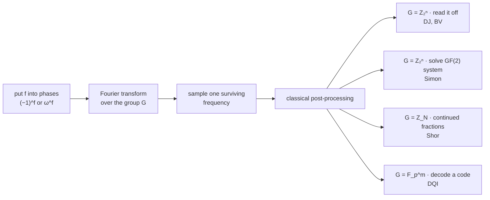

# Deep dive 01 — The Fourier thread

*A Fourier transform is the change of basis that diagonalises shift. Every
algorithm in this family exists because the structure hidden in $f$ is a
shift-invariance, and that is the one thing this basis makes visible.*

!!! tip "Where this page came from, and how to read it"

    [Autopsy 01 §5](../../predecessors/01-deutsch-jozsa/notes.md) has a
    collapsed box claiming that $H^{\otimes n}$ *is* the Fourier transform
    over $\mathbb{Z}_2^n$, and that the next twelve autopsies are variations
    on one skeleton. That box is four paragraphs. This page is the box, taken
    seriously.

    The main line assumes only what autopsy 01 built: qubits, superposition,
    phase kickback — **plus the ability to picture a spectrum**. If Fourier
    analysis is new to you, or you met it years ago and it has faded, read
    [the optional prerequisite](../00-fourier-primer/notes.md) first: it
    builds the whole classical picture from "a signal is a list of numbers",
    needs no calculus, and ends by deriving the Hadamard gate as the
    two-point Fourier transform. Half an hour, and this page becomes easy.

    **▸ deeper** boxes hold the algebra and the proofs — skip
    them on a first pass. Every widget is live; every number in the prose is
    computed by
    [`fourier_lab.py`](fourier_lab.py) and pinned by
    [`test_fourier_lab.py`](test_fourier_lab.py), so nothing here is
    asserted on authority.

    **The payoff is §6.** Sections 1–5 build the machinery; §6 is the
    sentence that explains why this mechanism has produced about four
    algorithms in forty years rather than four hundred, and §11 is what that
    means for [the hunt](../../hunt/README.md).

---

## 1. The one-sentence answer

Ask a signal-processing textbook what a Fourier transform is and you get
sine waves. Ask an algorithms textbook and you get $O(N \log N)$. Both are
downstream of something simpler.

Consider **shift**. On functions over a finite group $G$, define

$$
(S_a \varphi)(x) \;=\; \varphi(x - a)
$$

— relabel every input by moving it $a$ steps. There is one such operator per
group element, and here is the entire point:

!!! abstract "The fact everything rests on"

    All the shifts **commute** ($S_a S_b = S_{a+b} = S_b S_a$), so they can
    be simultaneously diagonalised. **The Fourier basis is their common
    eigenbasis.** A Fourier transform is not a tool for finding waves; it is
    the change of coordinates in which *every* shift becomes multiplication
    by a number.

That is why hidden periodicity is visible in this basis and invisible in
every other one. A period is a shift that does nothing — $f(x + r) = f(x)$ —
and in a basis where shift is diagonal, "a shift that does nothing" is
"eigenvalue 1", which is a readable label on a coordinate rather than a
global property of a table of values.

Watch it on $\mathbb{Z}_2^n$, where shifting means relabelling $x$ as
$x \oplus a$:

<div class="qq-anim" data-anim="shifteigen"></div>

Shift a generic function and its shape scrambles: about half the sixteen
signs change, and they change *differently* for each $a$. Shift a character
and the shape does not move at all — it comes back identical, or identical
with every sign flipped. One number, $\chi_z(a) = \pm 1$, absorbs the whole
shift. Those are eigenvectors, and the eigenvalue is that number.

??? note "▸ deeper — the two-line proof, and why the eigenvalue is a character"

    Suppose $\varphi$ is a simultaneous eigenvector of every shift:
    $S_a \varphi = \lambda(a)\, \varphi$ for all $a$. Applying two shifts in
    a row,

    $$
    \lambda(a+b) \varphi = S_{a+b}\varphi = S_a S_b \varphi
    = \lambda(a)\lambda(b)\,\varphi ,
    $$

    so $\lambda(a+b) = \lambda(a)\lambda(b)$: the eigenvalue map is a
    **homomorphism from $G$ into the nonzero complex numbers**. Unitarity
    forces $|\lambda| = 1$, so $\lambda: G \to$ unit circle. Such a map is
    called a **character**, and evaluating the eigenvector equation at
    $x = 0$ shows $\varphi(x) = \varphi(0)\,\lambda(-x)$ — the eigenvector
    *is* the character, up to normalisation.

    So we did not choose the Fourier basis and then discover it diagonalises
    shift. We asked which basis diagonalises shift and the characters came
    out. That is the correct order of the logic, and it is the reason the
    same construction works over $\mathbb{Z}_2^n$, over $\mathbb{Z}_N$, over
    $\mathbb{F}_p^m$, and stops working — for exactly identifiable reasons —
    on non-abelian groups (§9).

    Verified in code: `test_characters_are_shift_eigenvectors`,
    `test_a_delta_is_not_a_shift_eigenvector`, `test_shifts_commute`.

---

## 2. Characters, and the only computation in this subject

A **character** of a finite abelian group $G$ is a map
$\chi : G \to \mathbb{C}^{\times}$ with $\chi(x+y) = \chi(x)\chi(y)$.

- On $\mathbb{Z}_N$: $\chi_k(x) = e^{2\pi i k x / N}$, one per
  $k \in \{0, \dots, N-1\}$.
- On $\mathbb{Z}_2^n$: $\chi_z(x) = (-1)^{x \cdot z}$, one per $n$-bit
  string $z$. The unit circle has only two points of order two, so on
  $\mathbb{Z}_2^n$ *every phase is a sign*. Remember this — it is why the
  Hadamard layer needs no rotation gates and why everything over
  $\mathbb{Z}_2^n$ comes out exact.

A finite abelian group has exactly $|G|$ characters, which is why the
transform matrix is square, and they are **orthogonal**, which is the only
computation this subject ever really performs:

$$
\frac{1}{|G|}\sum_{x \in G} \chi_k(x)\,\overline{\chi_\ell(x)}
\;=\;
\begin{cases}
1 & k = \ell\\
0 & k \neq \ell
\end{cases}
$$

Every "interference" story in every quantum algorithm textbook is this
identity wearing a costume. Drive it yourself — set the two frequencies
equal, then differ by one:

<div class="qq-anim" data-anim="chardial"></div>

Matched frequencies: every term is $+1$, the walk never turns, the sum is
$N$. Mismatched by *anything*: the terms are the $N$-th roots of unity in
some order, the walk closes a polygon, and the sum is zero. Not
approximately zero. Zero.

<figure markdown="span">
  
  
  <figcaption>Left: the eight terms of one inner product on
  \(\mathbb{Z}_8\), laid head to tail. Right: all sixty-four inner products
  at once — the identity matrix, to \(7\times 10^{-16}\). Generated by
  <code>scripts/make_fourier_figures.py</code>.</figcaption>
</figure>

??? note "▸ deeper — the one-line proof, and the dual group"

    Let $\chi$ be a non-trivial character and $S = \sum_x \chi(x)$. Pick any
    $a$ with $\chi(a) \neq 1$. Since $x \mapsto x + a$ merely permutes $G$,

    $$
    S \;=\; \sum_x \chi(x+a) \;=\; \chi(a) \sum_x \chi(x) \;=\; \chi(a)\, S
    \quad\Longrightarrow\quad (1 - \chi(a))\,S = 0
    \quad\Longrightarrow\quad S = 0 .
    $$

    Apply it to $\chi = \chi_k \overline{\chi_\ell}$, which is trivial
    exactly when $k = \ell$. That is the whole theorem: **a sum over a group
    of a non-trivial character is zero, because the group can be shifted
    inside its own sum.** No geometry, no limits.

    The characters themselves form a group $\hat G$ under pointwise
    multiplication — the **dual group** — and for finite abelian $G$,
    $\hat G \cong G$. This self-duality is what lets a quantum algorithm hide
    an object in $G$ and read the answer in $\hat G$ without ever changing
    register size. It is also exactly what fails for non-abelian groups.

    Two more identities follow, and both get used below:

    - **Parseval**: $\sum_z |\hat F(z)|^2 = \sum_x |F(x)|^2$. The transform
      is unitary, so probability is conserved — this is why measuring after
      the transform is legal at all.
    - **Convolution**: the transform of $f * g$ is $\sqrt{|G|}\,\hat f \hat g$.
      Group structure becomes pointwise arithmetic. Every "the oracle's
      structure shows up as a product of spectra" argument is this.

    Verified: `test_characters_are_orthonormal`, `test_parseval`,
    `test_convolution_theorem_over_z2n`.

---

## 3. $H$ is a character table. That is not an analogy.

Write the Hadamard gate out:

$$
H \;=\; \frac{1}{\sqrt 2}\begin{pmatrix} 1 & 1\\ 1 & -1\end{pmatrix}
$$

Its two rows are the two characters of $\mathbb{Z}_2$: the trivial one
$(1, 1)$ and the sign one $(1, -1)$. There are no others. **$H$ is the
Fourier transform on $\mathbb{Z}_2$, entry for entry** — normalised, and
nothing left over.

Now: characters of a product group are products of characters, since
$\chi_{(z_1,z_2)}(x_1,x_2) = \chi_{z_1}(x_1)\chi_{z_2}(x_2)$. Therefore

$$
\underbrace{H \otimes H \otimes \cdots \otimes H}_{n}
\;=\;
\text{the character table of } \mathbb{Z}_2^n,
\qquad
\left(H^{\otimes n}\right)_{z,x} = 2^{-n/2}(-1)^{x \cdot z}.
$$

This is checked, not asserted: `test_hadamard_layer_is_the_z2n_character_table`
builds the matrix from the character definition and from the Kronecker
product independently, and compares them ($n \le 5$, agreement to
$10^{-16}$).

!!! abstract "The structural point most treatments skip"

    The group factorises, so the transform factorises, so **the circuit is
    $n$ gates deep instead of one $2^n \times 2^n$ matrix.** The tensor
    decomposition of the group *is* the circuit. When you later meet the QFT
    over $\mathbb{Z}_{2^n}$ costing $O(n^2)$ gates instead of $n$, that extra
    factor is the exact price of $\mathbb{Z}_{2^n}$ *not* factorising into
    small pieces the way $\mathbb{Z}_2^n$ does — the twiddle factors in §8
    are the interest payment.

---

## 4. What the Hadamard sandwich actually computes

Autopsy 01 ran this circuit: prepare $|0\dots0\rangle$, apply $H^{\otimes n}$,
call the oracle once (phase kickback), apply $H^{\otimes n}$, measure. After
the kickback the state is

$$
\frac{1}{\sqrt{2^n}} \sum_x (-1)^{f(x)}\, |x\rangle .
$$

Apply the final layer and read off the amplitude on $|z\rangle$:

$$
\langle z | H^{\otimes n} | \psi \rangle
= \frac{1}{2^n} \sum_x (-1)^{f(x)}(-1)^{x \cdot z}
= \widehat{F}(z),
\qquad F(x) := (-1)^{f(x)} .
$$

!!! abstract "So the state after the transform *is* the spectrum"

    Not "encodes" it, not "is related to" it: amplitude $z$ **is** Fourier
    coefficient $z$ of the sign function $(-1)^f$. All $2^n$ of them, one per
    basis state. Measuring returns a single $z$ with probability
    $\widehat F(z)^2$ — the operation known as **Fourier sampling**, and the
    only operation in this entire family.

Two immediate consequences, and both are the whole of autopsy 01:

1. $\widehat F(0) = 2^{-n}\sum_x (-1)^{f(x)}$ is the **mean** of the sign
   function: $+1$ for constant-0, $-1$ for constant-1, $0$ for balanced. The
   zero-frequency coefficient of any function is its average.
2. By Parseval the total probability is 1, so a constant $f$ puts *all* of it
   on $|0\dots0\rangle$ and a balanced $f$ puts *none* there. One query, zero
   error. Deutsch–Jozsa is that sentence.

Edit a function and watch its spectrum move. Try to build one whose answer
you could read from a single sample — then load the **bent** preset, which is
designed so that you cannot:

<div class="qq-anim" data-anim="spectrumlab"></div>

<figure markdown="span">
  
  
  <figcaption>Identical circuit, four promises on \(f\) (n = 6). The
  mechanism never changes; only the shape of the spectrum does — and with it,
  whether anything is readable.</figcaption>
</figure>

!!! question "Stop and think"

    The bent preset $f = x_0x_1 \oplus x_2x_3$ has $|\widehat F(z)| = 1/4$
    for **every** $z$ — a perfectly flat spectrum, verified in code. What
    does one Fourier sample tell you about such an $f$, and who builds
    functions like this on purpose?

    ??? success "One answer"

        Nothing: every outcome has probability exactly $1/16$, so the sample
        is a uniformly random string whatever the function was, and $n$ bits
        of measurement carry zero bits about $f$. Cryptographers build these
        on purpose — flat Walsh spectra are exactly the design criterion for
        S-boxes resisting linear cryptanalysis, because "linear
        cryptanalysis" *is* looking for a large Fourier coefficient.

        This is worth sitting with. The quantum mechanism and the classical
        attack are looking for the same object, so a cipher hardened against
        one is hardened against the other for free. Fourier sampling is not
        a generic solvent; it is a detector for one specific kind of
        structure, and its failure mode is a well-understood design target.

---

## 5. The butterfly, and three things a QFT cannot do

The classical fast transform (Cooley–Tukey, 1965) computes all $N$
coefficients in $N \log N$ arithmetic operations by recursion: split, solve
halves, combine in pairs. The quantum circuit performs the **identical**
butterfly — but each level is one Hadamard on one qubit, because level $k$ of
the recursion is exactly "the $k$-th coordinate of the group".

Step through it:

<div class="qq-anim" data-anim="butterfly"></div>

Three levels of butterfly on eight amplitudes: 24 classical additions and
subtractions, or 3 gates. In general $N \log N$ versus $\log N$. And now the
paragraph that matters more than anything else on this page:

!!! warning "This is not a fast Fourier transform, and believing it is has cost the field years"

    **1 · You cannot get the input in.** The transform acts on amplitudes.
    Loading $N$ arbitrary numbers as amplitudes costs $\Omega(N)$ — you have
    paid the classical price before the first gate fires. Every algorithm in
    this family therefore uses a function that is *computed*, never a table
    that is *loaded*.

    **2 · You cannot get the output out.** After the transform you hold
    $2^n$ coefficients you may not look at. Measurement returns one index $z$
    with probability $\widehat F(z)^2$. Learning even one coefficient to
    precision $\varepsilon$ costs $\Theta(1/\varepsilon^2)$ repetitions, and
    there are $2^n$ of them.

    **3 · Therefore the only useful outputs are properties decidable from a
    handful of samples of $|\widehat F|^2$.** That is not a limitation of
    current engineering. It is the shape of the door.

    Autopsy 01's fine print has the same flavour and deserves re-reading
    here: the query model charges for asking and not for building, and this
    is the crack through which over-claiming enters. The $\Omega(N)$ loading
    cost is the amplitude-side version of the same crack, and it is what
    [HHL and Tang](../../predecessors/10-hhl-tang/notes.md) is about.

---

## 6. The payload: which spectral shapes are readable

Fold §4 and §5 together and you get a filter that decides, in advance,
whether a problem can possibly join this family. One sample from
$|\widehat F|^2$ is all you get per query, so the spectrum must be
**concentrated, or structured, or both**:

| shape of $\widehat F$ | what one sample gives you | algorithm | group |
|---|---|---|---|
| all mass at $z = 0$ | the promise, decided | [Deutsch–Jozsa](../../predecessors/01-deutsch-jozsa/notes.md) | $\mathbb{Z}_2^n$ |
| one spike at $z = s$ | $s$ itself, all $n$ bits | [Bernstein–Vazirani](../../predecessors/02-bernstein-vazirani/notes.md) | $\mathbb{Z}_2^n$ |
| uniform on a subgroup $H^{\perp}$ | one linear equation about $H$ | [Simon](../../predecessors/03-simon/notes.md) | $\mathbb{Z}_2^n$ |
| comb with spacing $N/r$ | a multiple of $N/r$ → $r$ | [Shor](../../predecessors/04-shor/notes.md) | $\mathbb{Z}_N$ |
| concentrated on a *code*, needing a decoder | a codeword, after decoding | [DQI](../../predecessors/11-dqi/notes.md) | $\mathbb{F}_p^m$ |
| anything spread out | nothing | — | — |

That table is the deep dive. Read it as a **negative** result and it becomes
useful: the mechanism does not produce algorithms. *Structure in $f$ that
concentrates or organises the spectrum* produces algorithms, and there are
very few such structures known. Finding a problem someone actually cares
about whose hidden structure has one of these shapes **is the entire job** —
which is the thesis of this whole repository, arrived at from the algebra
rather than from the history.

<figure markdown="span">
  
  
  <figcaption>Left: collision entropy of the spectrum — Simon's is as spread
  as pure noise. Right: what it costs to reach the answer anyway. Spread
  alone does not decide readability; <em>structure</em> does.</figcaption>
</figure>

That left panel is the subtle part, and it is why the table says "or
structured". Simon's spectrum has $2^{n-1}$ equally likely outcomes — as
featureless, by any entropy measure, as a random function's. It is still
readable, because its outcomes are **a subgroup**: any $n-1$ independent
samples pin it down. Concentration is one route to readability; algebraic
closure is another, and it is the more powerful of the two.



Same skeleton every time. What changes is the group and the structure hidden
in $f$ — and, at the far right, how much classical work the post-processing
is allowed to do. That last column is where the modern frontier lives: DQI's
readout is a *decoder*, not a lookup, which is why it reaches problems the
first four cannot.

---

## 7. Coset states and the annihilator theorem

Here is the general statement that contains Simon, Shor and the whole hidden
subgroup story. Suppose $f$ is constant on cosets of a subgroup $H \le G$ and
takes distinct values on distinct cosets. Query it in superposition, measure
the output register, and the input register collapses to a **coset state**

$$
|x_0 + H\rangle \;=\; \frac{1}{\sqrt{|H|}} \sum_{h \in H} |x_0 + h\rangle
$$

for a random, unknown offset $x_0$. Now Fourier transform it.

!!! abstract "The annihilator theorem"

    The transform of a coset state is supported **exactly** on the
    annihilator

    $$
    H^{\perp} \;=\; \{\, \chi \in \hat G \;:\; \chi(h) = 1 \ \ \forall h \in H \,\},
    $$

    uniformly, with the unknown offset $x_0$ appearing only as a phase. So one
    measurement is **one uniform sample from $H^{\perp}$**, and the offset is
    unobservable — always, exactly, no approximation.

Since $|H| \cdot |H^{\perp}| = |G|$, samples from $H^{\perp}$ determine $H$:
collect enough to generate $H^{\perp}$, then dualise. On $\mathbb{Z}_2^n$
that is linear algebra over GF(2), which is Simon's algorithm, and the cost
is $n - 1$ independent equations plus a small coupon-collector overhead —
measured at $n - 1 + 1.6$ on average, never a power of two.

Run it, and watch the wasted shots:

<div class="qq-anim" data-anim="hsprank"></div>

Notice what is *not* happening in that widget. No amplitude is read; no
coefficient is estimated. The quantum device supplies uniform random elements
of a subgroup, and linear algebra does the rest. That division of labour —
**quantum sampling, classical solving** — is the honest description of every
algorithm in the family, and keeping it in view is the cheapest available
defence against over-claiming.

??? note "▸ deeper — proof, in four lines"

    $$
    \mathcal{F}\,|x_0 + H\rangle
    = \frac{1}{\sqrt{|H|}}\sum_{h}\frac{1}{\sqrt{|G|}}\sum_{\chi}
      \overline{\chi(x_0 + h)}\,|\chi\rangle
    = \sqrt{\frac{|H|}{|G|}} \sum_{\chi} \overline{\chi(x_0)}
      \left[\frac{1}{|H|}\sum_{h}\overline{\chi(h)}\right] |\chi\rangle .
    $$

    The bracket is the average of a character over a subgroup: it equals $1$
    when $\chi \in H^{\perp}$ and $0$ otherwise, by exactly the shifting
    argument of §2 applied inside $H$. So

    $$
    \mathcal{F}\,|x_0+H\rangle
    = \sqrt{\frac{|H|}{|G|}}\sum_{\chi \in H^{\perp}} \overline{\chi(x_0)}\,|\chi\rangle ,
    $$

    and every probability is $|H|/|G| = 1/|H^{\perp}|$, free of $x_0$. $\square$

    Verified for all subgroups and *all* offsets at $n \le 5$:
    `test_annihilator_theorem`, `test_coset_offset_only_moves_phases`.

!!! question "Stop and think"

    Simon's samples are useless for learning $x_0$. Is that a defect of the
    algorithm or a feature of the mechanism — and what would it take to read
    the offset instead of the period?

    ??? success "One answer"

        A feature, and an unavoidable one. The offset sits in a global phase
        of each amplitude, and no measurement sees a global phase. Reading it
        would require *interfering two different cosets*, which needs a
        second copy of the coset state with a known relative offset — exactly
        what the oracle refuses to give you. Mechanically: shift-invariance
        is what the Fourier basis exposes, and $x_0$ is precisely the
        shift-covariant part of the data. You are seeing the boundary of the
        mechanism, not a missing trick.

---

## 8. Changing the group: $\mathbb{Z}_N$, leakage, and Euclid

Everything so far was exact, because on $\mathbb{Z}_2^n$ every character
value is $\pm 1$ and every sum was an integer. Move to $\mathbb{Z}_N$ and the
characters become genuine complex phases $\omega^{kx}$,
$\omega = e^{2\pi i/N}$. The circuit picks up controlled rotations — the
twiddle factors — costing $O(n^2)$ gates for $N = 2^n$, and
`test_qft_circuit_equals_the_dft_matrix` confirms that this gate sequence
reproduces the full $2^n$-point transform to $10^{-15}$.

The mechanism is unchanged. What breaks is exactness.

A function with period $r$ gives, after the second register is measured, a
comb of spikes spaced $r$ apart. Its transform is a comb of peaks spaced
$N/r$ apart — **provided $r$ divides $N$.** When it does not, the geometric
sum no longer cancels perfectly and the peak smears into a Dirichlet kernel.
Shor's entire analysis is the bound on that smear.

<div class="qq-anim" data-anim="qftleak"></div>

<figure markdown="span">
  
  
  <figcaption>N = 256. Left: r = 16 divides N — sixteen exact spikes and
  nothing between them. Middle: r = 11 does not — every peak leaks. Right:
  one peak, with the exact Dirichlet envelope and the ±½ bin that Legendre's
  theorem needs.</figcaption>
</figure>

Two numbers from that experiment, both computed exactly rather than sampled:

- **Leakage costs less than you would guess.** At $N = 256$, $r = 11$,
  the mass within half a bin of an exact peak is $0.787$ — comfortably above
  the textbook floor of $4/\pi^2 \approx 0.405$
  (`test_leakage_stays_above_the_textbook_floor`).
- **Most failures are not leakage at all — they are arithmetic.** An outcome
  sitting *exactly* on a peak still fails when its index $j$ shares a factor
  with $r$, because $c/N = j/r$ then reduces and the denominator you recover
  is $r/\gcd(j,r)$. When $r \mid N$ there is no leakage whatsoever and the
  one-shot success rate is exactly $\varphi(r)/r$ — $0.5$ for $r = 16$,
  $0.909$ for $r = 11$ (`test_success_rate_is_the_coprime_fraction_when_r_divides`).
  Shor's repetitions pay for number theory, not for approximation. Almost
  every textbook presentation leaves that impression backwards.

The classical finish is continued fractions, and it is the same machinery
autopsy 04 walks through:

<div class="qq-anim" data-anim="contfrac"></div>

??? note "▸ deeper — why $2r^2 \le N$, and one beginner bug worth knowing"

    **Legendre's theorem.** If $|x - p/q| < 1/(2q^2)$ then $p/q$ is a
    convergent of the continued fraction of $x$. A measured $c$ within half a
    bin of $jN/r$ satisfies $|c/N - j/r| \le 1/(2N)$, so the theorem applies
    as soon as $1/(2N) < 1/(2r^2)$, i.e. **$N > r^2$** — the reason Shor's
    first register is sized at roughly twice the bit length of the number
    being factored. `test_legendre_guarantee_holds_inside_its_window` checks
    every good outcome decodes correctly inside that window.

    **The bug.** Take the *deepest* convergent whose denominator still fits
    under the bound, not the first one with $q > 1$. The convergents of
    $3/8$ are $0/1,\ 1/2,\ 1/3,\ 3/8$; stopping at $1/2$ reports a period of
    2 for a function of period 8. Pinned by
    `test_first_convergent_is_the_beginner_bug`.

    **Outside the window there is no guarantee**, and the failure is
    concrete: $15/256$'s convergents leap straight past the bound $q \le 16$,
    so the routine returns nothing even though $1/16$ is the closest fraction
    with a small denominator (`test_convergents_are_not_best_bounded_approximations`).

    Worth noticing: continued fractions are Euclid's algorithm, and so is
    Berlekamp–Massey, and so is the rational-reconstruction decoder at the
    heart of this repository's own
    [CRT-OPI construction](../../hunt/notes/A2-crt-opi-derivation.md). The
    same tool keeps reappearing at the readout end of Fourier-family
    algorithms. That is not a coincidence — see §11.

---

## 9. Where the thread snaps: non-abelian groups

If the hidden-subgroup story of §7 worked for every group, graph isomorphism
would have fallen thirty years ago: it reduces to finding a hidden subgroup
of the symmetric group $S_n$. It did not, and the reason is precise enough to
be worth stating exactly, because "quantum computers are bad at non-abelian
problems" is a slogan and slogans do not transfer.

For non-abelian $G$ the characters are no longer one-dimensional. The
irreducible representations have dimensions $d_\lambda > 1$, and the Fourier
transform maps functions to a *block* structure: an outcome is a triple
(representation $\lambda$, row, column). Three things break at once:

1. **The row/column labels are basis-dependent.** You must choose a basis
   inside each block before you can measure, and no canonical choice exists.
   The mechanism no longer hands you a well-defined answer.
2. **The offset stops being harmless.** In §7 the unknown $x_0$ hid in a
   phase. In a block of dimension $d_\lambda$ it becomes a $d_\lambda \times
   d_\lambda$ unitary mixing the outcomes — real, observable interference
   between the thing you want and the thing you cannot know.
3. **The statistics stop separating.** For $S_n$ with the subgroups relevant
   to graph isomorphism, the distribution over $\lambda$ from a single coset
   state is exponentially close to the distribution you get from the trivial
   subgroup. Moore–Russell–Schulman proved single-register measurement
   cannot distinguish them; Hallgren and co-authors showed that even *joint*
   measurement needs $\Omega(n \log n)$ registers, which pushes the required
   entangled measurement out of reach.

The full graveyard — with all three of those numbers *computed* rather than
cited, including the total-variation distance that makes point 3 concrete —
is [autopsy 05](../../predecessors/05-hsp-graveyard/notes.md). It also
sharpens the claim in a way worth knowing before you repeat the slogan: the
wall is **subgroup-specific, not group-specific**. Inside $S_n$, a hidden
transposition is easy to see and a hidden perfect matching is not, and graph
isomorphism hands you the second one.

The one-line transfer to the hunt: **the mechanism needs the hidden object's
shadow in the dual to be a set of labels you can name.** Abelian duality
gives you that for free ($\hat G \cong G$). Nothing else does.

---

## 10. The skeptic's section: what kills this mechanism

House rule — every mechanism gets attacked before it gets believed.

### It needs exact algebra, and pays second order for noise

Corrupt an $\varepsilon$ fraction of a linear function's values and the spike
drops to $1 - 2\varepsilon$, so single-shot success drops to
$(1-2\varepsilon)^2$: at 10% corruption a third of the answer is gone, and
the leaked mass spreads over all $2^n$ frequencies where no circuit can
recover it.

<figure markdown="span">
  
  
  <figcaption>Measured against theory, n = 10. The mechanism's exactness is
  its strength on paper and its exposure in a laboratory —
  <a href="../../predecessors/02-bernstein-vazirani/notes.md">autopsy 02</a>
  measures the same effect on real machine parameters and shows what majority
  voting buys back.</figcaption>
</figure>

### "All $2^n$ coefficients at once" is not an advantage

The most seductive sentence in this subject — *the quantum computer computes
every Fourier coefficient simultaneously* — is true and nearly worthless, and
the reason is a classical theorem. **Goldreich–Levin / Kushilevitz–Mansour**:
with membership queries, a classical randomised algorithm finds all Fourier
coefficients above any threshold $\theta$ in time polynomial in $n$ and
$1/\theta$. So sparse or concentrated spectra — the *only* spectra a quantum
Fourier sample can exploit, per §6 — are exactly the spectra a classical
learner can also find.

Sit with the unpleasant consequence: **the readable-spectrum condition and
the classically-learnable condition are nearly the same condition.** The
quantum advantage in this family never came from the transform. It came from
somewhere else in each case:

- **Simon**: the classical learner needs *membership queries to the same
  function*, and getting a useful Fourier coefficient classically requires
  finding a collision — which is $2^{n/2}$ by birthday. The quantum sample
  is free of that search. The separation lives in the collision cost, not in
  the transform.
- **Shor**: the oracle is *instantiated* — modular exponentiation, real
  arithmetic — and the hard part is that the period is exponentially large,
  so no polynomial number of classical queries reaches it. Again: not the
  transform.
- **Deutsch–Jozsa**: nowhere. The property is a mean, and 43 random samples
  decide it with failure probability $10^{-9}$ **at every $n$**
  (`test_the_classical_baseline_that_kills_deutsch_jozsa`). That number does
  not grow. The exponential separation is real only against *deterministic*
  classical machines, which is a statement about determinism, not difficulty.

### It dequantises where the answer needs amplitudes

Whenever the desired output is a *coefficient* rather than a *sample*,
classical sampling arguments tend to catch up — that is the
[HHL / Tang](../../predecessors/10-hhl-tang/notes.md) lesson, and the
boundary is sharp: sampling-and-query access to the input plus a
concentrated answer means a classical algorithm can usually imitate the
whole pipeline. The Fourier family survives only where the output is a
*label* (a frequency, a period, a codeword) rather than a *number*.

!!! danger "The compressed skeptic's checklist"

    Before believing any new "quantum Fourier" claim, ask in this order:

    1. Can the oracle be **instantiated** as an efficient circuit for a
       problem someone has?
    2. Is the output a **label**, or a number you would need $1/\varepsilon^2$
       shots to read?
    3. Is the spectrum concentrated? If yes — does
       **Kushilevitz–Mansour** already find it classically?
    4. Does the structure survive **noise**, or is it exact-algebra
       fragile?
    5. Is the classical baseline the *best known* algorithm, or a
       deterministic strawman?

    Deutsch–Jozsa fails 1 and 5. Simon passes all five with an oracle and
    fails 1 without one. Shor passes all five. That is the whole scoreboard
    of the family, and it took thirty years to get one line of it right.

---

## 11. What to take to the hunt

The reason this deep dive exists is not historical interest. It is that
[the problem-shape catalog](../../frontier/problem-shapes.md) and
[the hunt](../../hunt/README.md) are searching for exactly the object §6
describes, and being fluent in the mechanism is what lets you recognise a
candidate — or refuse one — in an afternoon rather than a month.

Three concrete transfers:

**The modern generalisation is the post-processing column, not the
transform.** DQI puts a *decoding problem* in the readout slot where Shor
put continued fractions. That is the live degree of freedom: the surviving
frequencies no longer have to be individually readable — they only have to
be *decodable*. Anything that widens the class of decodable structures
widens the family. This repository's own
[CRT-DQI construction](../../strike/crt-dqi-theorem.md) lives precisely
there: its decoder is continued fractions, the same Euclid appearing in §8's
deeper box, running over $\mathbb{Z}/M$ instead of $\mathbb{F}_p[y]$.

**Every kill in the graveyard is a §6 kill.** Whenever a proposed advantage
dies, check which row of the table it was claiming and which column failed —
the spectrum was not concentrated, or the concentration was classically
findable, or the group was non-abelian, or the readout was a number. Naming
the failure mode is faster than re-deriving it, and it keeps negative
results reusable.

**The mechanism is not the scarce resource. Problems are.** Autopsy 01's
verdict — *the mechanism was right and the problem was fake* — is the
sentence this whole page has been rebuilding from the algebra. Fourier
sampling is fully understood, cheap to implement, and available to anyone.
What is scarce is a problem whose hidden structure has one of the shapes in
§6, that someone actually needs solved, and whose classical difficulty has a
mechanism rather than an absence of effort. That is the hunt.

---

## 12. Your turn

Exercises, hardest last. The answers are all computable with
[`fourier_lab.py`](fourier_lab.py) — write the check before you trust the
argument.

1. **Warm-up.** $f(x) = x \cdot s \oplus 1$ (linear, flipped). Where does the
   spike land and what is its sign? Predict, then verify.
2. **The DJ boundary.** Build an $f$ that is neither constant nor balanced but
   still puts $>90\%$ of the probability on $z = 0$. What does the
   Deutsch–Jozsa circuit report, and why is "the promise" load-bearing rather
   than decorative?
3. **Two hidden periods.** Let $H = \{0, s_1, s_2, s_1 \oplus s_2\}$ with
   $s_1, s_2$ independent. How many samples until $H^{\perp}$ is spanned, and
   how does the answer scale with $\dim H$? Predict from §7, measure with
   `samples_to_span`.
4. **Leakage arithmetic.** For $N = 256$, find the $r$ with the *worst*
   one-shot recovery rate. Is your answer explained by leakage or by
   $\varphi(r)/r$? What does that predict for factoring an integer whose
   order is a power of two — and where in this repository has that already
   mattered?
5. **The hard one.** Design an $f$ whose spectrum is concentrated on a set
   that is *not* a coset of a subgroup and *not* a single spike, but from
   which some non-trivial property of $f$ is still recoverable in
   $\mathrm{poly}(n)$ samples. Then check your set against
   Kushilevitz–Mansour: is the property also classically learnable with
   membership queries? If it is, you have rediscovered §10. If it is not,
   write it up — that is a hunt candidate, and it belongs in
   [the ledger](../../hunt/ledger.md).

!!! tip "Running the code"

    ```bash
    .venv/bin/python study-deep-dive/01-fourier-thread/fourier_lab.py   # the demo table
    .venv/bin/python -m pytest study-deep-dive/ -q                      # 97 pinned claims
    .venv/bin/python scripts/make_fourier_figures.py                    # regenerate figures
    ```

---

## Sources

Read in this order if you want the primary literature rather than a
textbook:

- **Deutsch & Jozsa (1992)**, *Rapid solution of problems by quantum
  computation* — the sandwich, before anyone called it a Fourier transform.
- **Bernstein & Vazirani (1993/1997)**, *Quantum complexity theory* — the
  first place the transform is used as a transform.
- **Simon (1994)**, *On the power of quantum computation* — coset states, and
  the first genuine exponential separation.
- **Shor (1994/1997)**, *Polynomial-time algorithms for prime factorization
  and discrete logarithms* — the group changes and the leakage analysis
  appears.
- **Kitaev (1995)**, *Quantum measurements and the abelian stabilizer
  problem* — phase estimation as the unifying primitive.
- **Kushilevitz & Mansour (1993)** and **Goldreich & Levin (1989)** — the
  classical side: finding large Fourier coefficients with membership queries.
  §10 rests on these.
- **Moore, Russell & Schulman (2005/2008)**, *The symmetric group defies
  strong Fourier sampling* — the precise reason §9's wall is a wall.
- **Terras**, *Fourier Analysis on Finite Groups and Applications* — the
  mathematics, if you want the general theory rather than the algorithms.
- **Jordan et al. (2024)**, *Optimization by Decoded Quantum Interferometry*
  (arXiv 2408.08292) — the readout-as-decoder generalisation §11 points at.

*Deep dive 01. Next in the queue is chosen from
[the menu](../index.md) — add a row when something in an autopsy makes you
want the full derivation.*
